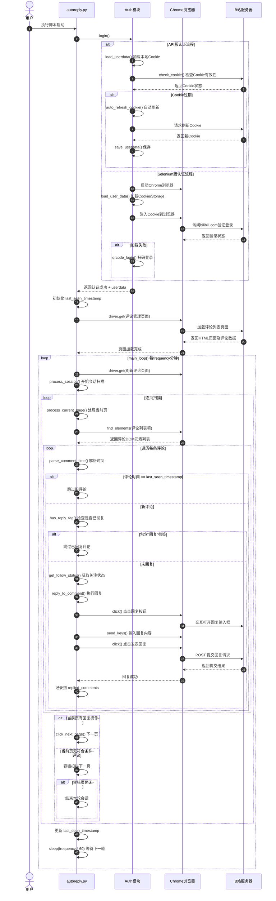
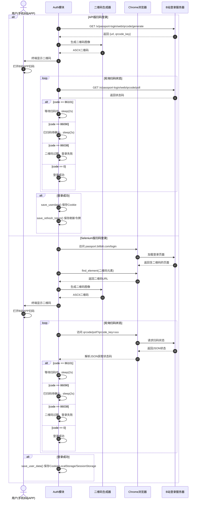
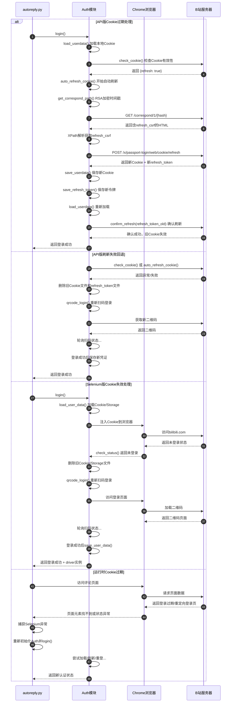

# B站自动回复工具 时序图 (Sequence Diagram)

## 1. 主流程时序图：从程序启动到成功回复一条评论

### 图表解释

#### 1. 整体概述
- 本图覆盖从脚本启动到成功回复一条新评论的完整主流程，涵盖认证初始化、浏览器启动、评论扫描、条件判断和回复提交五个阶段
- 涉及用户、主程序脚本、认证模块、Chrome浏览器和B站服务器共5个参与者
- 展示了双版本（API版/Selenium版）认证融合后统一的自动回复主链路

#### 2. 关键元素说明
- **用户**：执行脚本并输入扫描起始时间的系统使用者
- **autoreply.py**：程序入口，负责调度认证、初始化浏览器、驱动主循环和评论处理流程
- **Auth模块**：封装了API版和Selenium版两种认证方式的登录逻辑，向上层屏蔽版本差异
- **Chrome浏览器**：Selenium控制的浏览器实例，负责页面渲染、DOM操作和与B站前端的交互
- **B站服务器**：提供登录状态验证、评论数据查询和回复提交接口的后端服务

#### 3. 关键流程/关系说明
1. 用户执行脚本后，主程序首先调用Auth模块完成登录认证：API版通过requests会话管理Cookie，Selenium版通过浏览器实例管理Cookie/LocalStorage/SessionStorage
2. 认证成功后主程序初始化`last_seen_timestamp`（用户可输入自定义时间，默认当前时间），该时间戳是区分"新评论"与"旧评论"的核心依据
3. 主程序启动Chrome并加载Cookie，打开B站创作中心评论管理页面，进入`main_loop()`无限循环
4. 每轮循环中，`process_session()`从当前页开始逐页扫描：通过XPath定位评论列表项，对每条评论解析时间、检查回复标签、获取关注状态
5. 对于满足条件的新评论（时间新 + 未回复 + 非排除用户），根据关注状态选择不同话术，通过Selenium模拟点击回复按钮→输入内容→点击提交，成功后记录到内存集合`replied_comments`防止重复回复
6. 分页采用容错机制：当前页无符合条件评论时，额外扫描一页确认无遗漏后才结束本轮会话

#### 4. 关键技术解释
- **双版本认证融合**：API版使用requests+Cookie文件适合轻量场景，Selenium版使用真实浏览器+完整Storage适合需要页面交互的场景，两套认证通过统一接口封装
- **时间戳驱动的增量扫描**：`last_seen_timestamp`作为全局水位线，只处理发布时间晚于该时间的评论，避免重复处理历史数据
- **内存去重集合**：`replied_comments`采用"用户mid-评论时间"组合键，保证同一用户多次评论也能分别回复
- **XPath DOM定位**：通过`//div[contains(@class, 'comment-list-item')]`等XPath表达式在渲染后的页面中精确定位评论元素和操作按钮
- **容错分页扫描**：当单页无符合条件评论时，不立即结束而是多扫一页，防止因页面加载延迟或动态渲染导致的漏判

#### 5. 设计意图
- **为什么要这样设计**：将认证、页面控制、评论处理逻辑分层，使得主循环只关注"何时扫描、处理什么"，而不关心"怎么登录、怎么点击"
- **解决了什么痛点**：B站评论管理页面是动态加载的SPA，通过Selenium模拟真实用户操作可以绕过前端渲染壁垒；时间戳机制避免了全量扫描的性能浪费
- **带来了什么好处**：增量扫描使每轮处理量恒定，不受历史评论累积影响；内存去重+回复标签双重校验确保不会重复骚扰用户
- **如果不这样会怎样**：若缺少时间戳过滤，每次都要扫描全部历史评论，随着评论增长性能线性下降；若缺少容错扫描，可能因页面加载时序问题漏掉新评论

---

## 2. 登录子流程时序图：扫码登录的详细交互

### 图表解释

#### 1. 整体概述
- 本图展示两种技术路线（API版/Selenium版）下扫码登录的完整交互流程，从获取二维码到登录成功保存凭证
- 核心差异在于API版直接通过HTTP请求与B站服务器交互，Selenium版通过浏览器页面间接获取状态和提交请求
- 涉及用户、认证模块、二维码生成器、Chrome浏览器和B站登录服务器共5个参与者

#### 2. 关键元素说明
- **用户(手机B站APP)**：在手机上打开B站客户端扫描二维码并确认登录的操作者
- **Auth模块**：协调二维码获取、状态轮询和凭证保存的认证控制器
- **二维码生成器**：基于`qrcode`库将URL转换为终端可显示的ASCII艺术二维码
- **Chrome浏览器**：Selenium版中用于加载登录页面、执行页面操作和获取二维码元素的浏览器实例
- **B站登录服务器**：提供二维码生成接口和状态轮询接口的Passport认证服务

#### 3. 关键流程/关系说明
1. **二维码获取阶段**：API版直接向`passport.bilibili.com/x/passport-login/web/qrcode/generate`发送GET请求获取二维码URL和`qrcode_key`；Selenium版先让浏览器加载登录页面，再从页面DOM中提取二维码元素的`title`属性获取URL
2. **二维码展示阶段**：两种版本都使用Python的`qrcode`库生成ASCII二维码，通过`qr.print_ascii(invert=True)`在终端打印，用户使用手机B站APP扫描
3. **状态轮询阶段**：API版直接HTTP轮询`qrcode/poll`接口；Selenium版让浏览器访问该接口URL，从页面`<pre>`标签中提取JSON文本解析状态码
4. **状态码处理**：`86101`表示等待扫码，`86090`表示已扫码待手机确认，`86038`表示二维码已过期（3分钟有效期），`0`表示登录成功
5. **凭证保存**：API版保存Cookie文件（SESSDATA/DedeUserID/bili_jct等）和refresh_token文件；Selenium版额外保存LocalStorage和SessionStorage以确保浏览器状态完整恢复

#### 4. 关键技术解释
- **qrcode_key**：B站生成的唯一二维码标识符，轮询时必须携带该参数，服务端通过它关联扫码设备和登录会话
- **ASCII二维码**：`qrcode`库支持在终端直接打印黑白块组成的二维码，无需GUI环境即可使用，适合服务器部署场景
- **RSA加密刷新令牌**：API版中`get_correspond_path()`使用B站公钥对时间戳进行PKCS1_OAEP加密，用于后续Cookie刷新流程的身份验证
- **Storage全量保存**：Selenium版不仅保存Cookie，还保存LocalStorage和SessionStorage，因为B站前端可能将部分会话状态存储在这些位置，仅恢复Cookie可能导致登录状态不完整
- **轮询间隔2秒**：平衡实时性和服务器压力，既不会频繁请求导致限流，又能及时感知用户扫码动作

#### 5. 设计意图
- **为什么要这样设计**：扫码登录是B站官方支持的无密码认证方式，相比账号密码登录更安全，且不易触发风控
- **解决了什么痛点**：在 headless 服务器环境中无法打开图形界面，ASCII二维码让纯终端环境也能完成扫码登录；双版本设计覆盖不同运行环境
- **带来了什么好处**：API版轻量快速，适合长期后台运行；Selenium版状态完整，适合需要浏览器上下文的场景；refresh_token机制支持Cookie自动续期
- **如果不这样会怎样**：若使用账号密码登录，容易被B站风控系统识别为异常登录并要求验证码；若不保存refresh_token，Cookie过期后必须重新扫码，用户体验差

---

## 3. 异常处理时序图：Cookie过期自动刷新或重新登录

### 图表解释

#### 1. 整体概述
- 本图展示B站自动回复工具在Cookie过期或失效场景下的三种异常处理路径：API版自动刷新、API版刷新失败回退扫码、Selenium版失效重登、运行时过期重初始化
- 体现了"自动恢复优先，人工介入兜底"的容错设计思想
- 涉及主程序、认证模块、Chrome浏览器和B站服务器共4个参与者

#### 2. 关键元素说明
- **autoreply.py**：异常捕获和恢复调度的主控程序，负责在检测到认证失效时重新初始化认证流程
- **Auth模块**：封装了Cookie检查、自动刷新、凭证清理和重新登录的完整异常恢复逻辑
- **Chrome浏览器**：Selenium版中承载页面状态和Cookie的浏览器实例，Cookie失效时页面会表现为未登录状态
- **B站服务器**：提供Cookie有效性检查、自动刷新接口和登录状态验证的认证服务

#### 3. 关键流程/关系说明
1. **API版自动刷新（正常路径）**：`check_cookie()`发现`refresh=true`时，调用`auto_refresh_cookie()`：先用RSA公钥加密时间戳获取`correspond_path`，请求该路径获取`refresh_csrf`，再携带旧`refresh_token`调用Cookie刷新接口，成功后保存新Cookie和新refresh_token，最后调用`confirm_refresh()`使旧Cookie失效
2. **API版刷新失败回退**：若自动刷新过程中任一环节失败（解析refresh_csrf失败、刷新接口返回错误等），Auth模块删除旧凭证文件，回退到`qrcode_login()`重新扫码获取全新会话
3. **Selenium版失效重登**：`load_user_data()`后`check_status()`发现未登录，删除旧Storage文件，通过浏览器访问登录页面重新扫码，成功后保存完整的Cookie+LocalStorage+SessionStorage
4. **运行时过期重初始化**：主循环运行中若B站返回登录过期页面，Selenium操作会因元素找不到抛出异常，主程序捕获后重新实例化Auth模块并调用`login()`完成恢复

#### 4. 关键技术解释
- **Cookie刷新机制**：B站提供官方Cookie刷新接口，通过`refresh_csrf`和`refresh_token`双重验证确保刷新请求合法性，防止Cookie被盗用后长期有效
- **RSA+OAEP加密**：`get_correspond_path()`使用B站预置公钥对`refresh_{timestamp}`进行加密，这是B站刷新流程的身份验证手段，确保只有持有正确密钥的客户端才能发起刷新
- **confirm_refresh的原子性**：刷新成功后必须调用确认接口使旧refresh_token失效，这是B站设计的安全机制，防止旧凭证被重复使用
- **Storage全量清理**：Selenium版失效时不仅删除Cookie文件，还删除LocalStorage和SessionStorage文件，避免旧状态污染新会话
- **异常捕获与重初始化**：主循环通过try-except捕获Selenium的`NoSuchElementException`等异常，识别为认证失效后重新走完整登录流程，实现无人值守的自动恢复

#### 5. 设计意图
- **为什么要这样设计**：B站Cookie有有效期限制，长期运行的自动回复工具必须能自动处理过期，否则每次过期都需要人工重新扫码
- **解决了什么痛点**：自动刷新机制让API版在Cookie过期时无需人工干预即可恢复；Selenium版虽然无法自动刷新，但通过完整的Storage保存和清理机制确保重新登录后状态干净
- **带来了什么好处**：API版实现了真正的无人值守，refresh_token机制让Cookie可以无限续期；运行时异常捕获使程序在遇到临时认证问题时能自愈，不会直接崩溃退出
- **如果不这样会怎样**：若缺少自动刷新，API版用户需要定期手动重新扫码；若运行时异常未被捕获，程序会在Cookie过期后直接崩溃，失去自动回复的意义；若旧Storage未清理，可能导致新登录后状态混乱

---

*生成时间: 2026-05-14*
*模式: 深度*
*所属项目: B站自动回复工具*
*文件包含: 3 张图*
