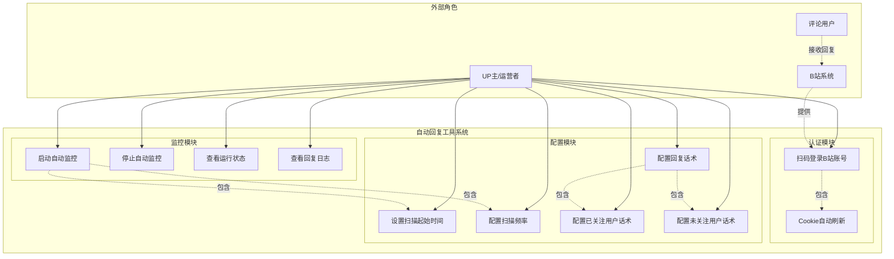
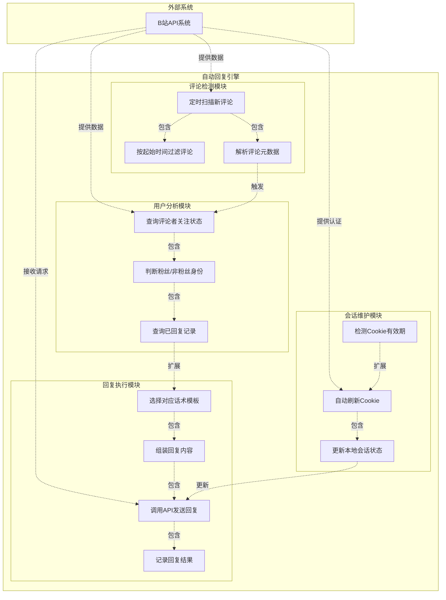

# B站自动回复工具 用例图 (Use Case Diagram)

## 1. UP主视角用例图

### 图表解释

#### 1. 整体概述

- 该图从 UP主/运营者 的视角展示 B站自动回复工具 的完整交互功能，覆盖认证、配置、监控三大核心模块
- 解决 UP主 手动逐条回复评论耗时耗力的痛点，通过自动化工具实现评论的智能批量回复
- 核心看点：区分已关注/未关注用户的差异化话术配置，以及扫描起始时间设置避免骚扰历史评论

#### 2. 关键元素说明

- **UP主/运营者**：工具的主要使用者，负责配置参数、启动监控、查看运行状态，是主动触发所有用例的核心角色
- **B站系统**：外部系统角色，提供扫码登录入口、评论数据接口、用户关注状态查询及回复发送能力
- **评论用户**：被动角色，在视频下留言后接收系统自动回复，不直接与工具交互
- **认证模块（UC1/UC2）**：扫码登录获取 Cookie，系统自动维持登录态防止过期
- **配置模块（UC3–UC7）**：扫描起始时间、频率、差异化话术的配置中心
- **监控模块（UC8–UC11）**：启动/停止监控、查看状态与日志的控制台

#### 3. 关键流程/关系说明

1. **登录流程**：UP主触发 UC1（扫码登录），该用例通过包含关系强制依赖 UC2（Cookie自动刷新），确保登录态持续有效
2. **话术配置流程**：UP主触发 UC5（配置回复话术），该用例包含 UC6（已关注用户话术）和 UC7（未关注用户话术），体现差异化回复的强制性配置要求
3. **监控启动流程**：UP主触发 UC8（启动自动监控），该用例包含 UC3（扫描起始时间）和 UC4（扫描频率），确保启动前必须完成核心参数配置
4. **B站系统**通过"提供"关系关联 UC1，表示扫码登录依赖 B站 的 OAuth/二维码接口；**评论用户**通过"接收回复"关系关联 B站系统，表示回复最终通过 B站 平台送达

#### 4. 关键技术解释

- **扫码登录**：基于 B站 OAuth2.0 或二维码登录协议，工具生成二维码后由 UP主 使用 B站 App 扫码授权，获取 SESSDATA 等 Cookie
- **Cookie 自动刷新**：通过定时检测 Cookie 有效期，在过期前调用刷新接口或重新触发扫码流程，维持会话连续性
- **扫描起始时间**：时间戳过滤机制，工具仅获取该时间点之后的评论，避免对历史评论重复处理
- **差异化话术**：基于 B站 API 查询评论者的关注状态（is_follower 字段），路由到不同的话术模板，体现策略模式

#### 5. 设计意图

- **为什么要这样设计**：将 UP主 的操作按功能域划分为认证、配置、监控三大模块，符合用户心智模型
- **解决了什么痛点**：UP主 无需手动逐条回复，差异化话术提升粉丝粘性，起始时间设置避免对老评论的无效打扰
- **带来了什么好处**：模块化配置降低使用门槛，包含关系确保关键前置步骤不被遗漏，差异化回复增强用户运营精细化程度
- **如果不这样会怎样**：缺少起始时间设置会导致启动时瞬间处理大量历史评论引发刷屏；缺少差异化话术则粉丝与普通用户感受一致，降低运营效果

---

## 2. 系统内部用例图

### 图表解释

#### 1. 整体概述

- 该图展示 B站自动回复工具 内部引擎的自动执行用例，覆盖评论检测、用户分析、回复执行、会话维护四大核心模块
- 解决系统无人值守时如何自动完成"检测-分析-回复-维护"闭环的问题
- 核心看点：防重复回复机制（UC6）与 Cookie 自动刷新（UC11–UC13）保障系统长期稳定运行

#### 2. 关键元素说明

- **B站API系统**：外部系统角色，提供评论列表接口、用户关系接口、回复发送接口、认证刷新接口
- **评论检测模块（UC1–UC3）**：定时拉取新评论并按起始时间过滤，解析评论 ID、内容、时间、评论者 UID 等元数据
- **用户分析模块（UC4–UC6）**：查询评论者是否关注 UP主，判断粉丝身份，并查询该评论是否已被回复过
- **回复执行模块（UC7–UC10）**：根据粉丝状态选择话术模板，组装内容，调用 B站 API 发送回复，并记录结果
- **会话维护模块（UC11–UC13）**：后台检测 Cookie 有效期，在过期前自动刷新，更新本地会话状态确保后续请求合法

#### 3. 关键流程/关系说明

1. **评论检测流程**：UC1（定时扫描）包含 UC2（按起始时间过滤）和 UC3（解析元数据），确保只处理有效范围内的新评论
2. **用户分析流程**：UC3 完成后触发 UC4（查询关注状态），UC4 包含 UC5（判断身份）和 UC6（查询已回复记录），形成完整的用户画像
3. **回复执行流程**：UC6 通过扩展关系触发 UC7（选择话术模板），仅当评论未被回复过时才进入回复流程；UC7 包含 UC8（组装内容）、UC9（发送回复）、UC10（记录结果），构成完整的回复闭环
4. **会话维护流程**：UC11（检测有效期）通过扩展关系触发 UC12（自动刷新），UC12 包含 UC13（更新状态），UC13 的更新结果反向保障 UC9 的调用有效性

#### 4. 关键技术解释

- **定时扫描机制**：基于 cron 或 asyncio 定时任务，按配置的扫描频率轮询 B站 评论接口（如 `/x/v2/reply`），实现被动拉取模式
- **防重复回复（UC6）**：本地维护已回复评论的数据库/文件记录（评论 ID + 回复时间），发送前查询去重，避免同一评论多次回复导致刷屏
- **关注状态查询**：调用 B站 用户关系接口（如 `/x/relation`）获取评论者与 UP主 的关注关系，依据 `attribute` 字段判断是否为粉丝
- **Cookie 自动刷新**：检测 SESSDATA 等关键 Cookie 的过期时间，在阈值内调用刷新接口或利用 refresh_token 机制续期，防止因登录态失效导致全部功能中断
- **扩展关系的使用**：UC6→UC7 和 UC11→UC12 使用扩展关系，表示防重复和会话刷新是条件触发的可选分支，保持主流程简洁

#### 5. 设计意图

- **为什么要这样设计**：将自动执行流程按职责划分为检测、分析、执行、维护四层，每层内部高内聚、层间低耦合
- **解决了什么痛点**：无人值守时系统可能因 Cookie 过期全面失效，或因重复回复被 B站 限流/封号；分层设计使故障定位与修复更精准
- **带来了什么好处**：防重复机制保护账号安全，Cookie 自动刷新保障 7×24 小时运行，差异化话术提升回复质量与用户体验
- **如果不这样会怎样**：缺少防重复回复会导致同一评论多次回复，触发 B站 反 spam 机制导致账号受限；缺少 Cookie 自动刷新则登录过期后系统静默失效，UP主 难以察觉

---

*生成时间: 2026-05-14*
*模式: 深度*
*所属项目: B站自动回复工具*
*文件包含: 2 张图*
