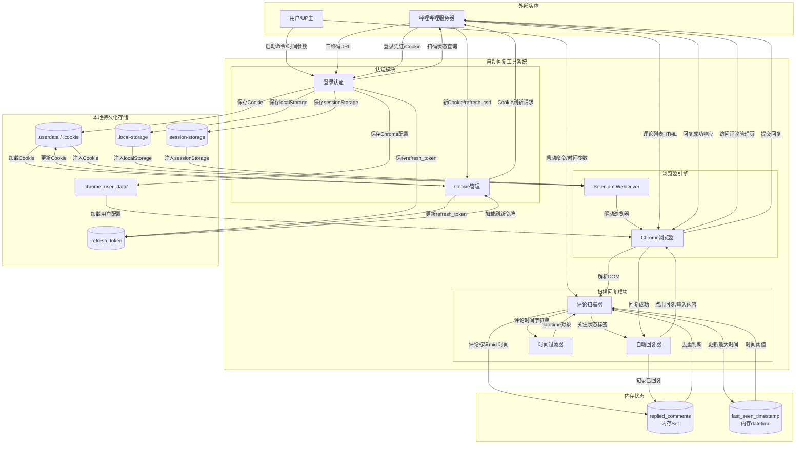
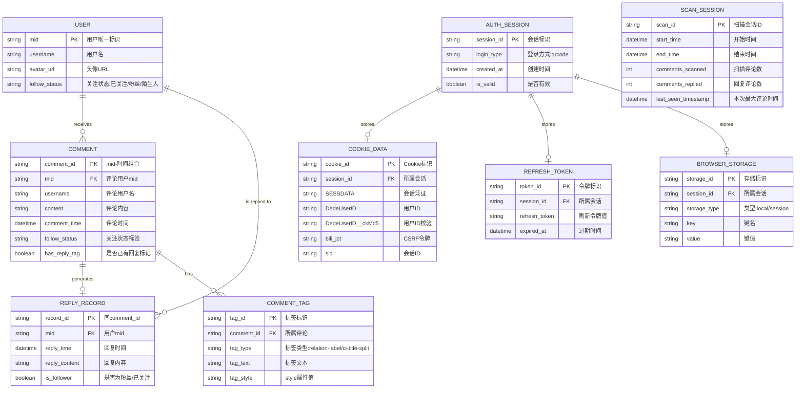
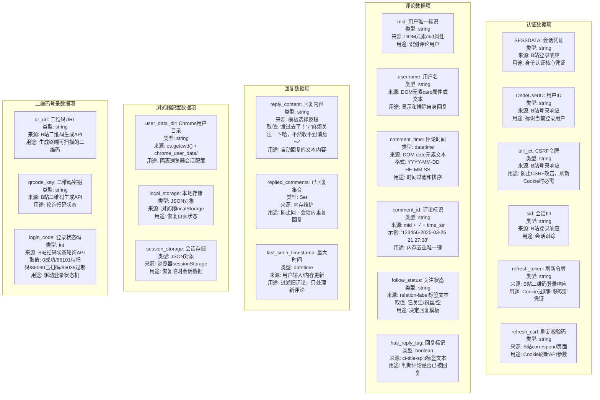

# B站自动回复工具 数据流E-R图 (Data Flow & E-R Diagram)

## 1. 整体数据流图

### 图表解释

#### 1. 整体概述
- 这张图是B站自动回复工具的系统级数据流图（DFD Level 0），展示了工具与B站服务器、用户之间的完整数据交互边界
- 系统分为三大核心模块：认证模块（负责登录与会话维持）、扫描回复模块（负责评论检测与自动回复）、浏览器引擎（负责页面渲染与交互）
- 数据流覆盖了从登录凭证获取、本地持久化、浏览器状态注入，到评论扫描、过滤、自动回复的全链路

#### 2. 关键元素说明
- **哔哩哔哩服务器**：外部数据源与操作目标，提供二维码、登录凭证、评论列表、接收回复请求
- **认证模块**：处理扫码登录流程，管理Cookie生命周期，支持自动刷新
- **Cookie管理**：负责本地Cookie文件的读写和过期自动刷新
- **评论扫描器**：通过Selenium驱动浏览器访问评论管理页，解析DOM提取评论信息
- **时间过滤器**：将评论时间字符串解析为datetime对象，与内存中的时间阈值比较
- **自动回复器**：根据关注状态选择回复模板，执行点击、输入、提交操作
- **内存Set（replied_comments）**：存储已回复评论的mid-时间组合标识，防止重复回复
- **内存datetime（last_seen_timestamp）**：记录上次扫描的最大评论时间，作为本轮过滤阈值

#### 3. 关键流程/关系说明
1. 用户启动工具，输入扫描起始时间参数
2. 认证模块检查本地Cookie，若无效则触发二维码登录流程，从B站获取新Cookie并持久化到本地文件
3. Cookie管理模块定期检测Cookie有效性，过期时调用刷新API获取新凭证
4. 浏览器引擎加载本地Cookie、Storage数据和Chrome用户配置，建立与B站的会话
5. 评论扫描器驱动浏览器访问评论管理页，获取评论列表HTML
6. 扫描器解析每条评论的时间、用户mid、关注状态，生成评论标识
7. 时间过滤器将字符串时间解析为datetime，与last_seen_timestamp比较，只处理新评论
8. 自动回复器根据关注状态（已关注/粉丝/陌生人）选择不同回复模板
9. 回复成功后，评论标识写入内存Set，同时更新最大时间到last_seen_timestamp

#### 4. 关键技术解释
- **双模式认证**：API模式（requests.Session）用于高效的Cookie刷新和状态查询，Selenium模式用于需要浏览器环境的扫码登录和页面操作
- **RSA+OAEP加密**：Cookie刷新时，使用B站公钥对时间戳加密生成correspond_path，获取refresh_csrf
- **内存状态管理**：replied_comments和last_seen_timestamp仅存于内存，程序重启后重新构建，依赖时间过滤避免重复处理历史评论
- **Selenium WebDriver**：通过XPath定位DOM元素，模拟真实用户的点击、输入、提交行为

#### 5. 设计意图
- **为什么要这样设计**：将认证、扫描、回复、浏览器操作分离为独立模块，各自职责清晰，便于维护和扩展
- **解决了什么痛点**：UP主需要频繁手动回复大量相似评论，工具通过自动化释放人力；Cookie自动刷新避免频繁重新登录
- **带来了什么好处**：模块化架构使得认证方式、回复策略、浏览器配置均可独立替换；内存去重+时间过滤双重机制确保不重复回复
- **如果不这样会怎样**：若所有逻辑耦合在一个脚本中，Cookie刷新、评论解析、回复操作的错误会相互影响，难以定位和修复；缺少时间过滤会导致每次扫描重复处理历史评论，效率低下

---

## 2. 详细E-R图

### 图表解释

#### 1. 整体概述
- 该图是B站自动回复工具的详细实体-关系图（E-R图），展示了系统中涉及的核心业务实体、它们的属性以及实体间的关联关系
- 实体分为三个域：用户评论域（USER、COMMENT、REPLY_RECORD、COMMENT_TAG）、认证会话域（AUTH_SESSION、COOKIE_DATA、REFRESH_TOKEN、BROWSER_STORAGE）、扫描会话域（SCAN_SESSION）
- 图中标注了主键（PK）、外键（FK）和实体间的基数关系（一对多、一对一、多对多）

#### 2. 关键元素说明
- **USER（用户）**：评论的发布者，以mid为主键，包含用户名、头像和关注状态
- **COMMENT（评论）**：B站评论管理页中的单条评论，主键为mid与时间字符串的组合，确保同一用户多次评论也能分别记录
- **REPLY_RECORD（回复记录）**：工具对评论执行回复后生成的记录，与评论一对一对应
- **COMMENT_TAG（评论标签）**：评论DOM中的标签元素，如关注状态标签（relation-label）和回复标记（ci-title-split），用于判断评论属性
- **AUTH_SESSION（认证会话）**：一次完整的登录会话，关联Cookie、刷新令牌和浏览器存储
- **COOKIE_DATA（Cookie数据）**：具体的Cookie键值对，包括SESSDATA、DedeUserID、bili_jct等核心凭证
- **REFRESH_TOKEN（刷新令牌）**：B站Cookie刷新机制所需的令牌，用于获取新Cookie
- **BROWSER_STORAGE（浏览器存储）**：localStorage和sessionStorage中的键值数据，用于恢复浏览器状态
- **SCAN_SESSION（扫描会话）**：单次扫描周期的统计信息，记录扫描范围和处理结果

#### 3. 关键流程/关系说明
1. USER与COMMENT为一对多关系：一个用户可以发布多条评论
2. USER与REPLY_RECORD为一对多关系：一个用户可能收到多条自动回复
3. COMMENT与REPLY_RECORD为一对一关系：每条评论最多产生一条回复记录
4. COMMENT与COMMENT_TAG为一对多关系：一条评论包含多个DOM标签（关注状态、回复标记等）
5. AUTH_SESSION与COOKIE_DATA为一对多关系：一个会话包含多个Cookie字段
6. AUTH_SESSION与REFRESH_TOKEN为一对一关系：一个会话对应一个刷新令牌
7. AUTH_SESSION与BROWSER_STORAGE为一对多关系：一个会话包含多条浏览器存储记录

#### 4. 关键技术解释
- **复合主键设计**：COMMENT使用mid+时间字符串作为复合主键，而非单一自增ID，这是因为工具需要跨会话识别同一条评论，且B站评论本身不提供独立ID
- **邻接表模型**：COMMENT_TAG通过comment_id外键关联评论，支持一条评论携带多个标签，便于扩展新的标签类型
- **会话隔离**：AUTH_SESSION作为中心实体，将Cookie、刷新令牌、浏览器存储统一关联，支持多账号场景的扩展（当前为单账号）
- **内存与持久化分离**：REPLY_RECORD和SCAN_SESSION在代码中主要存在于内存，设计为实体便于理解数据逻辑；实际持久化仅依赖文件系统的Cookie和令牌

#### 5. 设计意图
- **为什么要这样设计**：将运行时内存中的逻辑概念（已回复记录、扫描会话）显式建模为实体，使数据流转关系清晰化
- **解决了什么痛点**：避免了"已回复"和"时间过滤"两个机制在代码中隐式存在、难以追踪的问题
- **带来了什么好处**：E-R图为后续引入数据库持久化（如SQLite）提供了直接的Schema设计依据；扫描会话实体支持生成统计报表
- **如果不这样会怎样**：若缺乏实体关系建模，开发者难以理解replied_comments和last_seen_timestamp与其他数据的关联，扩展功能时容易破坏数据一致性

---

## 3. 数据字典

### 图表解释

#### 1. 整体概述
- 该图是B站自动回复工具的数据字典，以结构化方式定义了五类核心数据项的语义、类型、来源和用途
- 数据字典覆盖认证凭证、评论信息、回复状态、浏览器配置和二维码登录五个子域
- 作为系统元数据的核心组成部分，为开发者提供统一的数据定义规范，消除理解歧义

#### 2. 关键元素说明
- **SESSDATA/DedeUserID/bili_jct/sid**：B站Cookie的四大核心字段，构成会话认证的基础
- **refresh_token/refresh_csrf**：Cookie刷新双因子，refresh_token持久化存储，refresh_csrf通过RSA加密实时获取
- **mid/username/comment_time**：评论的三元组信息，mid来自DOM属性，时间来自DOM文本
- **comment_id**：由mid和时间字符串拼接的复合标识，是内存去重集合的唯一键
- **follow_status**：从relation-label标签提取，决定使用"发过去了！"还是"麻烦关注一下哈，不然收不到消息～"
- **replied_comments/last_seen_timestamp**：内存状态数据，分别负责同会话去重和跨会话时间过滤
- **qr_url/qrcode_key/login_code**：二维码登录流程的三要素，驱动扫码状态机运转

#### 3. 关键流程/关系说明
1. 认证数据项流向：B站登录响应 → 本地文件（.userdata/.refresh_token）→ 内存Session → 浏览器Cookie注入
2. 评论数据项流向：B站评论管理页HTML → Selenium DOM解析 → 时间解析/关注状态识别 → 评论标识生成
3. 回复数据项流向：关注状态判断 → 模板选择 → 回复内容输入 → 提交成功 → 写入replied_comments集合
4. 时间过滤流程：DOM时间字符串 → datetime.strptime解析 → 与last_seen_timestamp比较 → 新评论进入回复流程
5. 浏览器配置流向：本地文件（.cookie/.local-storage/.session-storage）→ Chrome启动参数 → 页面状态恢复

#### 4. 关键技术解释
- **Cookie四字段机制**：SESSDATA是核心会话凭证，DedeUserID标识用户，bili_jct是CSRF防护令牌（所有写操作必需），sid是会话跟踪ID。四字段共同构成完整的B站认证状态
- **RSA-OAEP加密获取refresh_csrf**：使用B站公钥对`refresh_时间戳`加密，访问correspond页面获取refresh_csrf，这是B站Cookie刷新协议的安全校验环节
- **复合标识设计**：`mid-时间字符串`作为评论唯一键，利用了B站评论列表中每条评论必然有用户和时间的特性。潜在冲突：同一用户同一秒多次评论会视为同一条，但概率极低且不影响功能正确性
- **双Storage持久化**：localStorage持久化页面长期状态（如主题、配置），sessionStorage持久化临时会话状态（如当前导航位置），两者分别恢复确保页面行为一致性
- **login_code状态机**：86101（待扫码）→ 86090（已扫码待确认）→ 0（成功）/ 86038（过期），构成完整的二维码登录生命周期

#### 5. 设计意图
- **为什么要这样设计**：将分散在代码各处的数据定义集中显式化，建立团队对数据语义的一致理解
- **解决了什么痛点**：避免开发者对同一字段（如bili_jct的作用、comment_id的生成规则）理解不一致，减少集成时的接口摩擦
- **带来了什么好处**：为代码审查、故障排查、功能扩展提供直接的数据定义依据；新开发者可通过数据字典快速理解系统数据模型
- **如果不这样会怎样**：若缺乏统一数据字典，不同开发者可能对Cookie字段的用途、评论标识的生成逻辑、状态码的含义产生分歧，导致代码维护困难、Bug难以定位、新功能开发时容易破坏现有数据约定

---

*生成时间: 2026-05-14*
*模式: 深度*
*所属项目: B站自动回复工具*
*文件包含: 3 张图*
