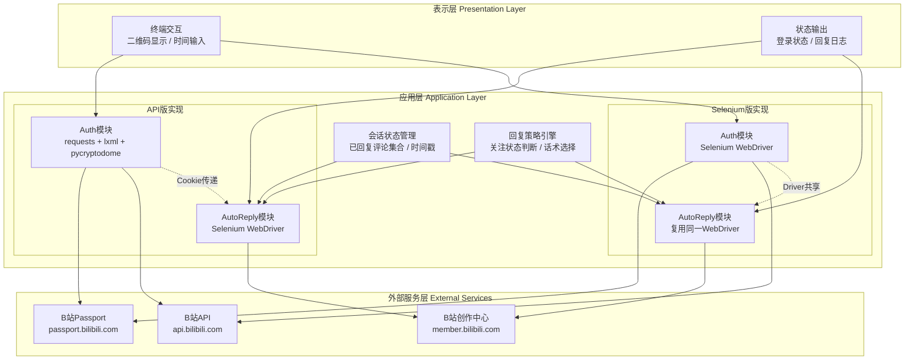
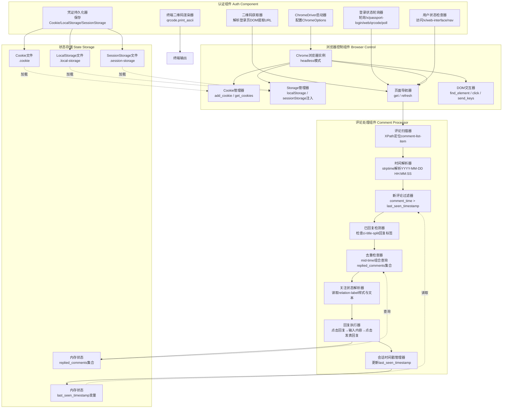
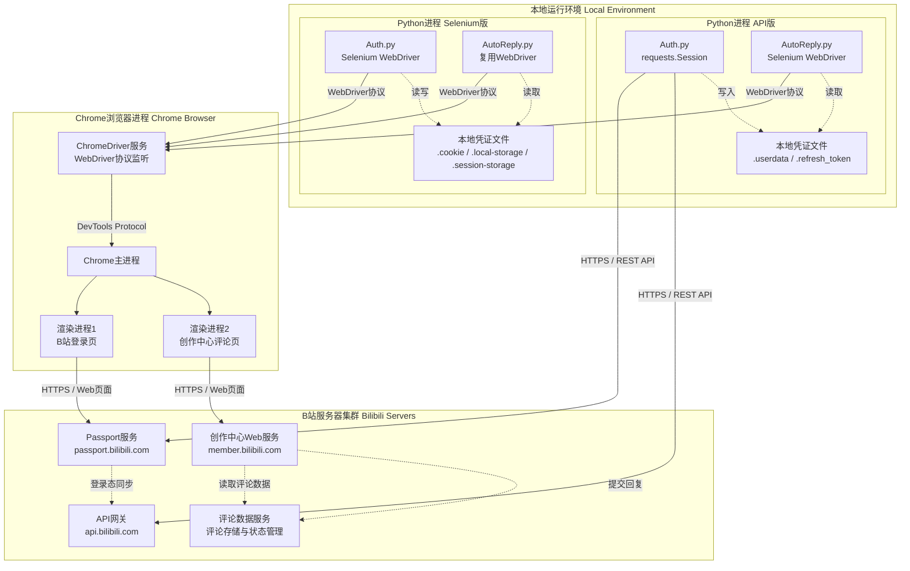

# B站自动回复工具 系统架构图 (System Architecture Diagram)

## 1. 高层架构图

### 图表解释

#### 1. 整体概述

- 系统采用三层纵向架构：表示层、应用层、外部服务层，两个实现版本（API版与Selenium版）在应用层并行存在
- API版采用"API认证 + Selenium操作"的混合模式：认证用requests调用B站Passport接口，回复用Selenium驱动浏览器
- Selenium版采用纯浏览器自动化：认证和回复共用同一个ChromeDriver实例，通过Cookie/LocalStorage持久化登录态

#### 2. 关键元素说明

- **表示层**：终端交互负责二维码显示（qrcode库生成ASCII二维码）和扫描时间输入；状态输出打印登录结果、回复日志到控制台
- **API版Auth模块**：基于requests.Session维护HTTP会话，通过RSA加密实现Cookie自动刷新，将登录凭证保存为JSON文件
- **API版AutoReply模块**：独立启动Selenium Chrome实例，加载API版Auth保存的Cookie，操作创作中心评论页面
- **Selenium版Auth模块**：直接用Selenium打开B站登录页，解析二维码元素，轮询登录状态，保存完整Cookie/LocalStorage/SessionStorage
- **Selenium版AutoReply模块**：复用Auth模块的同一WebDriver实例，避免重复启动浏览器
- **会话状态管理**：内存中的`replied_comments`集合去重，`last_seen_timestamp`记录本轮最新评论时间
- **回复策略引擎**：根据评论DOM中的`relation-label`判断关注状态，选择不同回复话术

#### 3. 关键流程/关系说明

1. **API版登录流程**：终端显示二维码 → Auth模块请求Passport生成二维码 → 用户扫码 → 轮询登录状态 → 保存Cookie到`.userdata`和`.refresh_token`
2. **API版回复流程**：AutoReply模块启动Chrome → 加载`.userdata`中的Cookie → 打开创作中心评论页 → 扫描新评论 → 按策略回复 → 更新内存时间戳
3. **Selenium版登录流程**：Auth模块启动Chrome → 打开登录页 → 提取二维码URL → 终端显示 → 轮询状态 → 保存Cookie/Storage三件套
4. **Selenium版回复流程**：复用同一Driver → 直接跳转评论页 → 同样的扫描/回复/时间戳更新逻辑
5. **跨层关系**：两个版本共享相同的表示层交互方式和外部服务目标，仅在应用层实现方式不同

#### 4. 关键技术解释

- **混合架构（API版）**：认证环节用HTTP API而非浏览器，是因为B站Passport的二维码登录和Cookie刷新有稳定接口，requests比Selenium更轻量、更快；但评论回复涉及复杂前端交互（点击回复按钮、输入框、提交），必须用Selenium模拟用户操作
- **RSA-OAEP加密**：API版用B站公钥加密时间戳获取`correspond_path`，这是B站Cookie刷新机制的安全校验，防止恶意刷新
- **WebDriver复用（Selenium版）**：认证和回复共用同一Chrome实例，减少浏览器启动开销（约2-3秒），且LocalStorage中的登录态无需跨进程传递
- **去重策略**：采用"用户mid + 评论时间"组合作为唯一标识，而非仅用户mid，确保同一用户的多次评论都能被分别回复

#### 5. 设计意图

- **为什么要这样设计**：B站创作中心没有开放评论回复的公开API，必须通过浏览器自动化操作页面；但登录认证有稳定接口，因此API版将认证和操作用不同技术栈实现，各取所长
- **解决了什么痛点**：纯Selenium方案启动两个浏览器实例（一个登录、一个操作）资源浪费；纯API方案无法完成页面交互型的回复动作
- **带来了什么好处**：API版认证更快、支持Cookie自动刷新；Selenium版实现更简单、状态管理更自然（同一浏览器上下文）
- **如果不这样会怎样**：若API版全程用Selenium，Cookie刷新需要额外处理页面跳转，复杂度上升；若Selenium版认证也用API，需要将Cookie精确注入到Selenium的存储中，跨技术栈传递容易丢失LocalStorage等关键状态

---

## 2. 详细组件图（以Selenium版为例）

### 图表解释

#### 1. 整体概述

- 本图聚焦Selenium版的内部组件交互，展示认证、浏览器控制、评论处理三大组件如何协作完成自动回复
- 组件间依赖关系清晰：认证组件初始化浏览器并持久化凭证，浏览器控制组件提供底层页面操作能力，评论处理组件实现业务逻辑
- 状态存储贯穿全生命周期，从磁盘文件到内存变量形成多层状态体系

#### 2. 关键元素说明

- **ChromeDriver启动器**：配置`--headless=new`、`--disable-blink-features=AutomationControlled`等参数，隐藏自动化特征，使用独立user-data-dir避免冲突
- **二维码获取器**：访问`passport.bilibili.com/login`，通过XPath定位二维码DOM元素，提取`title`属性中的二维码URL
- **终端二维码渲染器**：使用qrcode库将URL转为ASCII艺术二维码，直接显示在终端供手机扫描
- **登录状态轮询器**：每2秒访问`qrcode/poll`接口，解析返回JSON中的code字段（86101等待扫码、86090已扫码待确认、0登录成功、86038过期）
- **凭证持久化器**：登录成功后保存三类数据：Cookie（HTTP请求凭证）、LocalStorage（前端持久化数据）、SessionStorage（会话级数据）
- **DOM交互器**：通过XPath定位评论元素、回复按钮、输入框、提交按钮，执行点击和输入操作
- **新评论过滤器**：仅处理时间晚于`last_seen_timestamp`的评论，避免重复处理历史评论
- **已回复检测器**：检查评论DOM中是否存在`ci-title-split`文本为"回复"的标签，识别系统已自动标记的评论
- **回复执行器**：三步骤交互——点击"回复"链接打开输入框、清空并输入话术、点击"发表回复"按钮提交

#### 3. 关键流程/关系说明

1. **认证流程**：启动器创建Chrome实例 → 获取器打开登录页提取二维码 → 渲染器显示ASCII二维码 → 轮询器循环检查状态 → 检查器确认登录成功 → 持久化器保存三件套凭证
2. **状态恢复流程**：启动器创建Chrome → Cookie管理器加载`.cookie` → Storage管理器加载`.local-storage`和`.session-storage` → 检查器验证登录态
3. **单条评论处理流程**：扫描器获取评论列表 → 时间解析器提取评论时间 → 过滤器判断是否为新增 → 已回复检测器排除已处理 → 去重检查器排除本轮已回复 → 关注状态解析器判断关系 → 回复执行器发送消息 → 时间戳管理器更新会话进度
4. **分页容错流程**：当前页无新评论时，点击下一页进行一次"容错扫描"，若仍无则结束本轮；若有则继续翻页，防止因页面加载延迟漏评

#### 4. 关键技术解释

- **反自动化检测绕过**：`--disable-blink-features=AutomationControlled`和`excludeSwitches`移除Chrome的自动化标记，`navigator.webdriver`属性被隐藏，使B站前端难以识别为机器人
- **XPath定位策略**：评论元素使用`//div[contains(@class, 'comment-list-item')]`，回复按钮使用`//span[contains(@class, 'reply action')]/a[text()='回复']`，依赖B站创作中心的前端DOM结构
- **时间戳增量扫描**：不记录"已处理到第几页"，而是记录"已处理到哪个时间"，因为评论可能因排序变化在不同页间移动，时间戳更稳定可靠
- **内存去重+时间过滤双保险**：时间过滤处理跨会话的去重（下次启动不处理旧评论），内存集合处理会话内的去重（防止同一轮中重复回复）

#### 5. 设计意图

- **为什么要这样设计**：将认证、浏览器控制、业务逻辑分离，使各组件职责单一；认证只需做一次，评论处理循环执行，分离后避免代码纠缠
- **解决了什么痛点**：若认证和回复逻辑混在一起，每次轮询回复都要检查登录态，代码冗余；DOM操作细节（XPath、等待时间）与业务规则（谁回复、回复什么）混杂时难以维护
- **带来了什么好处**：认证组件可独立测试（验证能否登录B站）；评论处理组件可在已登录的浏览器上反复运行；更换回复策略无需改动认证逻辑
- **如果不这样会怎样**：若所有逻辑写在一个大循环中，XPath变更时需要全文搜索替换；登录态过期时的重登逻辑会与回复逻辑交织，增加bug风险

---

## 3. 部署架构图

### 图表解释

#### 1. 整体概述

- 本图展示程序运行时的物理部署拓扑，包含本地Python进程、Chrome浏览器进程、B站服务器集群三类节点
- API版和Selenium版在本地各为一个独立的Python进程，但浏览器交互方式不同：API版的AutoReply单独启动Chrome，Selenium版两模块共享同一Chrome
- 所有网络通信均通过HTTPS，本地组件间通过WebDriver协议或文件系统交互

#### 2. 关键元素说明

- **Python进程（API版）**：`Auth.py`用requests直接与B站Passport/API通信，`AutoReply.py`用Selenium操作浏览器，两者通过`.userdata`文件传递Cookie
- **Python进程（Selenium版）**：`Auth.py`和`AutoReply.py`运行在同一进程空间，共享同一个WebDriver实例，通过`.cookie`等三件套文件实现跨会话持久化
- **ChromeDriver服务**：作为HTTP服务器监听WebDriver协议（通常是9515端口），将Python的Selenium指令转为Chrome DevTools Protocol命令
- **Chrome渲染进程**：每个标签页运行在独立渲染进程中，API版的登录页和评论页可能在同一进程或不同进程（取决于Chrome版本和站点隔离策略）
- **B站Passport服务**：负责二维码生成、登录状态轮询、Cookie签发与刷新，是B站统一的认证中心
- **B站API网关**：提供`x/web-interface/nav`等接口，用于查询当前登录用户信息
- **创作中心Web服务**：提供`member.bilibili.com/platform/comment/article`页面，是评论管理的Web前端
- **评论数据服务**：后端存储实际评论数据，处理回复提交请求，与前端页面通过Ajax/WebSocket同步

#### 3. 关键流程/关系说明

1. **API版认证通信**：Auth.py → HTTPS请求 → Passport服务（生成二维码、轮询状态、获取Cookie）→ 保存到本地`.userdata`
2. **API版回复通信**：AutoReply.py → WebDriver协议 → ChromeDriver → Chrome → 加载Cookie → 访问创作中心页面 → HTTPS → 创作中心Web服务
3. **Selenium版认证通信**：Auth.py → WebDriver协议 → ChromeDriver → Chrome → 访问登录页 → HTTPS → Passport服务 → 人工扫码 → 页面跳转记录Cookie
4. **Selenium版回复通信**：复用同一Chrome实例 → 直接跳转评论页 → 与创作中心Web服务交互 → 操作DOM提交回复
5. **跨进程文件传递**：API版的Auth通过写`.userdata`文件，AutoReply通过读该文件实现跨模块Cookie传递；Selenium版的三件套文件用于跨会话恢复登录态

#### 4. 关键技术解释

- **WebDriver协议**：基于HTTP的JSON Wire Protocol（或W3C WebDriver标准），Python客户端向ChromeDriver发送`POST /session/{id}/element`等请求，ChromeDriver再转译为CDP命令控制Chrome
- **Chrome DevTools Protocol (CDP)**：Chrome内置的调试协议，ChromeDriver通过CDP实现页面导航、元素查找、点击、输入等底层操作
- **站点隔离（Site Isolation）**：现代Chrome为不同站点启用独立渲染进程，B站登录页（passport.bilibili.com）和创作中心（member.bilibili.com）可能运行在不同进程中，但Cookie/Storage通过浏览器主进程共享
- **凭证文件安全**：`.userdata`和`.cookie`以明文JSON存储敏感凭证，依赖文件系统权限保护；没有加密存储是因为工具面向个人本地使用，非生产服务部署

#### 5. 设计意图

- **为什么要这样设计**：个人自动化工具不需要服务器集群，本地单机运行即可满足需求；Python+Selenium是社区最成熟的浏览器自动化方案，B站没有开放评论回复API，必须通过浏览器操作
- **解决了什么痛点**：创作者需要频繁手动回复评论，工具替代重复劳动；双版本设计让用户根据环境选择（API版适合有稳定网络的环境，Selenium版适合需要完整浏览器上下文的环境）
- **带来了什么好处**：本地部署零运维成本，无需申请B站开放平台权限；Chrome headless模式可在无GUI服务器运行；时间戳增量扫描确保重启后不会重复回复
- **如果不这样会怎样**：若部署为服务端服务，需要维护B站账号池、处理多账号并发、应对B站风控，复杂度指数级上升；若用纯HTTP API方案，B站未开放评论回复接口，无法实现核心功能

---

*生成时间: 2026-05-14*
*模式: 深度*
*所属项目: B站自动回复工具 (bilibili-autoreply)*
*文件包含: 3 张图*
