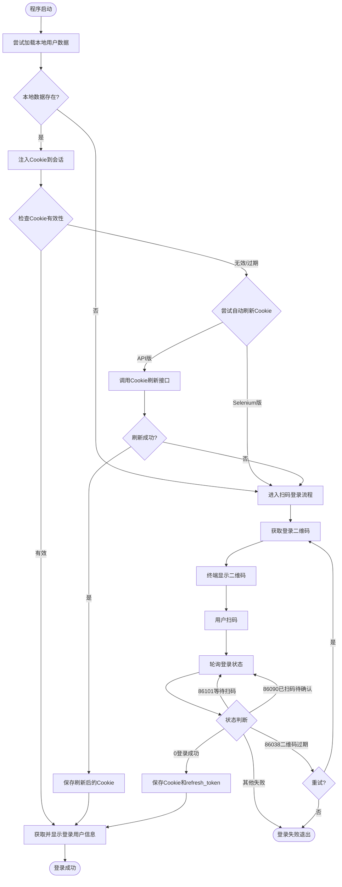
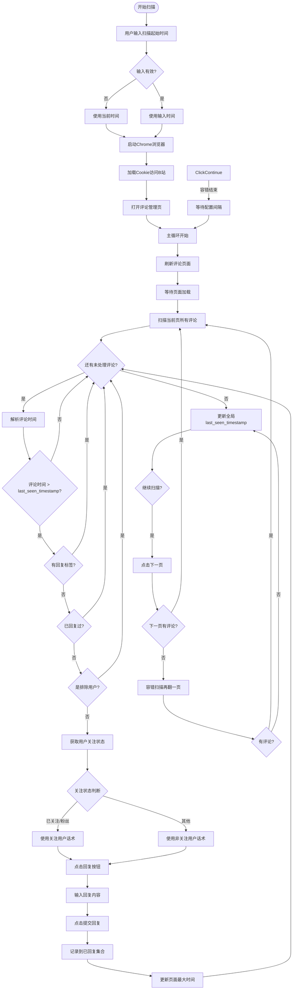
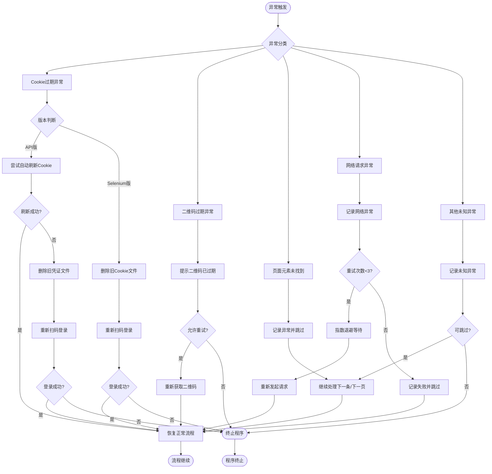

# B站自动回复工具 业务流程图 (Business Process Diagram)

## 1. 登录业务流程图

### 图表解释

#### 1. 整体概述
- 该图展示B站自动回复工具从启动到成功登录的完整认证流程，涵盖本地Cookie复用、自动刷新和扫码登录三种认证路径
- 流程以"优先复用、其次刷新、最后扫码"为设计原则，最大限度减少用户手动操作
- 三种路径最终均收敛到"获取并显示用户信息"节点，确保后续业务模块获得统一的已认证会话上下文

#### 2. 关键元素说明
- **本地用户数据**：持久化存储的Cookie文件（`.userdata`/`.cookie`）和refresh_token文件（`.refresh_token`/`.refresh_token`），用于会话复用
- **Cookie有效性检查**：通过访问B站passport接口或nav接口，判断当前会话是否仍具备平台访问权限
- **自动刷新Cookie**：利用refresh_token调用B站Cookie刷新接口，延长会话有效期，避免频繁重新登录
- **二维码轮询**：以2秒为间隔循环查询扫码状态，覆盖等待扫码、已扫码待确认、过期三种状态码
- **终端二维码显示**：使用`qrcode`库将登录URL渲染为ASCII字符画，在无GUI环境下实现扫码登录

#### 3. 关键流程/关系说明
1. 程序启动后首先尝试加载本地用户数据，不存在则直接进入扫码登录
2. 数据存在时注入Cookie并检查有效性，有效则直接获取用户信息完成登录
3. Cookie无效时，API版本尝试自动刷新：获取correspond_path → 提取refresh_csrf → 调用刷新接口 → 保存新Cookie
4. 刷新失败或Selenium版本则进入扫码登录：获取二维码 → 终端显示 → 用户扫码 → 轮询状态
5. 扫码状态码86101（等待）和86090（已扫码）继续轮询；86038（过期）可重试；0（成功）保存凭证并结束

#### 4. 关键技术解释
- **RSA+OAEP加密**：`get_correspond_path()`使用B站公钥对`refresh_{timestamp}`进行PKCS1_OAEP加密，生成刷新请求所需的hash参数，属于平台强制的安全校验机制
- **Cookie持久化**：将SESSDATA、DedeUserID、bili_jct等关键凭证序列化为JSON，下次启动时注入requests.Session或Selenium浏览器上下文，实现跨进程会话复用
- **轮询与状态机**：扫码登录采用客户端轮询模式，通过状态码驱动有限状态机流转，配合2秒间隔和超时机制平衡实时性与请求频率
- **双版本适配**：API版基于requests.Session实现轻量级HTTP交互；Selenium版基于ChromeDriver模拟真实浏览器，处理更复杂的JavaScript渲染和反爬检测

#### 5. 设计意图
- **为什么要这样设计**：采用分层降级策略，优先无感复用已有凭证，其次自动续期，最后才要求用户介入扫码，实现从全自动到人工辅助的平滑过渡
- **解决了什么痛点**：避免了每次启动都需手动扫码的低效操作，Cookie过期时自动刷新减少中断，终端二维码显示适配服务器/远程环境
- **带来了什么好处**：登录模块对上层业务透明，凭证管理集中化，多种认证方式互补覆盖不同部署场景
- **如果不这样会怎样**：无Cookie复用则每次启动都需扫码，操作成本高；无自动刷新则Cookie短期过期后频繁中断；无终端二维码则无法在无显示器环境部署

---

## 2. 评论回复业务流程图

### 图表解释

#### 1. 整体概述
- 该图展示评论监控与自动回复的完整业务流程，以"时间驱动+状态过滤"为核心策略，确保只回复在扫描起始时间之后产生的新评论
- 流程采用外层主循环（定时刷新）与内层页级循环（逐页扫描）的双层嵌套结构，配合单条评论的多级过滤条件，形成精确的回复控制
- 关注状态感知的话术选择机制，使回复内容根据用户关系动态调整，提升交互体验

#### 2. 关键元素说明
- **last_seen_timestamp**：会话级时间水位线，记录本轮已处理的最新评论时间，用于区分新旧评论，避免重复处理
- **已回复集合（replied_comments）**：内存中的Set结构，以"用户mid-评论时间"组合为键，保证同一用户多次评论也能分别回复
- **回复标签检测**：通过XPath检查评论标题区域是否包含"回复"文本，识别平台已标记的回复评论，避免重复操作
- **关注状态**：从评论DOM中提取relation-label的显示文本，区分"已关注"、"粉丝"和普通用户
- **容错扫描**：当当前页无符合条件的评论时，额外翻一页确认，防止因分页延迟或动态加载导致的漏判

#### 3. 关键流程/关系说明
1. 启动阶段：用户输入扫描起始时间（或默认当前时间），初始化全局时间戳
2. 主循环：刷新评论管理页 → 等待加载 → 进入页级扫描循环
3. 单条评论处理链：解析时间 → 判断是否新评论 → 检查回复标签 → 检查已回复集合 → 排除当前用户 → 获取关注状态 → 选择话术 → 执行回复 → 记录标识
4. 时间更新：每页扫描结束后，用本页新评论的最大时间更新会话级session_max_time，会话结束时同步到全局last_seen_timestamp
5. 分页控制：当前页有回复则继续下一页；无回复则触发容错扫描，容错页也无回复则结束本轮，等待配置的间隔时间（默认3分钟）后重新开始

#### 4. 关键技术解释
- **时间水位线机制**：通过`datetime.strptime`解析评论时间字符串，与`last_seen_timestamp`进行大小比较，实现精确的新评论识别，避免全量扫描的低效
- **DOM解析与XPath定位**：使用Selenium的`find_element(By.XPATH)`精确提取评论元素、时间文本、用户mid和关注标签，处理动态渲染的SPA页面
- **内存去重策略**：采用Python Set存储已回复标识，O(1)时间复杂度查询，避免对同一评论的重复回复；程序重启后自然清空，配合时间水位线防止跨会话重复
- **异步等待与容错**：`time.sleep(1)`等待回复框出现，`time.sleep(3)`等待页面加载，配合try-except捕获元素查找异常，确保单条评论失败不中断整体流程

#### 5. 设计意图
- **为什么要这样设计**：以时间为核心维度过滤评论，配合多级状态检查，在自动化和精确性之间取得平衡，避免骚扰用户或触发平台反爬
- **解决了什么痛点**：避免了全量扫描的性能浪费，防止对已回复评论的重复操作，通过关注状态感知的话术提升回复转化率
- **带来了什么好处**：时间水位线使每轮扫描范围收敛，内存去重保证单会话内幂等，容错扫描减少漏回复，定时轮询实现准实时监控
- **如果不这样会怎样**：无时间过滤会导致旧评论被反复处理；无去重机制会对同一评论多次回复引发骚扰；无话术区分会降低关注转化率；无容错扫描可能因分页边界问题漏掉新评论

---

## 3. 异常处理流程图

### 图表解释

#### 1. 整体概述
- 该图展示B站自动回复工具运行过程中各类异常的分级处理策略，覆盖认证、交互、网络和未知异常四大类别
- 每类异常配备针对性的恢复路径：Cookie过期走刷新或重登、二维码过期走重试、元素缺失走跳过、网络异常走退避重试
- 所有可恢复异常最终均收敛到"恢复正常流程"节点，不可恢复异常则导向程序终止，形成防御性编程的闭环

#### 2. 关键元素说明
- **Cookie过期异常**：通过B站passport接口检测到`refresh=true`或nav接口返回未登录状态，触发凭证失效处理
- **二维码过期（86038）**：B站二维码有效期为3分钟，超时后状态码变为86038，需重新获取
- **页面元素未找到**：Selenium操作DOM时，目标元素可能因页面结构变更、异步加载延迟或反爬机制导致XPath定位失败
- **网络请求异常**：包括DNS解析失败、连接超时、TCP重置、HTTP 5xx服务端错误等传输层异常
- **指数退避等待**：网络重试时采用递增延时策略（如1s, 2s, 4s），降低对目标服务器的请求压力

#### 3. 关键流程/关系说明
1. Cookie过期分支：API版优先尝试自动刷新（调用refresh接口），成功则恢复；失败则删除旧凭证重新扫码。Selenium版直接删除旧凭证重登
2. 二维码过期分支：提示用户后判断是否允许重试，是则重新获取二维码并展示，否则终止
3. 元素未找到分支：记录异常日志后跳过当前操作（单条评论或单页），继续处理后续内容，避免单点失败阻塞整体任务
4. 网络异常分支：记录异常后进入最多3次的重试循环，每次重试前增加退避等待，超过上限则记录失败并跳过
5. 其他异常分支：记录未知异常后判断是否可以跳过，可跳过则继续循环，不可跳过则安全终止程序

#### 4. 关键技术解释
- **防御性编程**：在关键操作（Cookie加载、元素查找、网络请求）外包裹try-except块，捕获具体异常类型并执行预设恢复策略，避免未处理异常导致程序崩溃
- **凭证安全清理**：Cookie刷新失败或过期时，主动删除本地`.userdata`和`.refresh_token`文件，防止无效凭证被反复加载，确保下次启动走完整认证流程
- **指数退避算法**：网络重试时等待时间按指数增长，公式为`wait_time = base * (2 ** attempt)`，既给网络恢复留出时间，又避免固定间隔重试被识别为攻击模式
- **优雅降级**：单条评论处理失败不影响同页其他评论，单页失败不影响后续分页，通过局部跳过实现全局任务的连续性

#### 5. 设计意图
- **为什么要这样设计**：将异常按来源和影响范围分类，每类异常配备最合适的恢复策略，避免"一刀切"式的统一重试或统一退出
- **解决了什么痛点**：Cookie过期不处理会导致后续所有请求失败；元素查找失败不捕获会导致整轮扫描中断；网络抖动不 retry 会丢失数据；无退避策略会加剧服务器负担
- **带来了什么好处**：分级处理使恢复策略精准匹配异常根因，重试上限防止无限循环，跳过机制保证任务连续性，凭证清理避免无效状态累积
- **如果不这样会怎样**：统一重试对Cookie过期无效，浪费请求；无跳过机制会使单条评论XPath变更导致整轮任务失败；无退避策略会在网络故障时形成请求风暴；无凭证清理会使过期Cookie反复注入导致持续认证失败

---

*生成时间: 2026-05-14*
*模式: 深度*
*所属项目: B站自动回复工具*
*文件包含: 3 张图*
