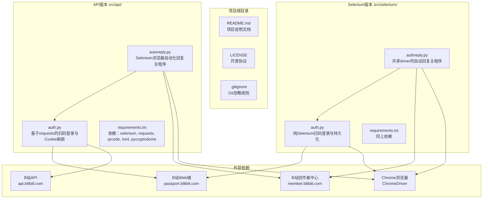
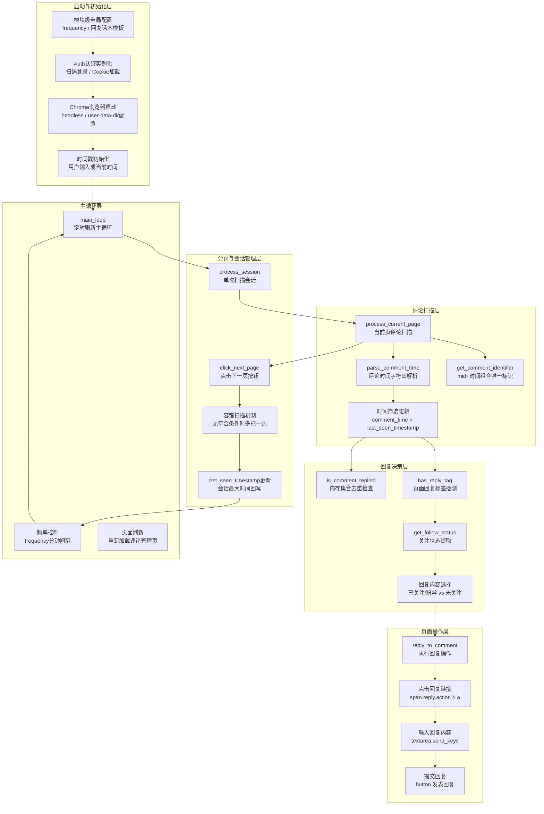
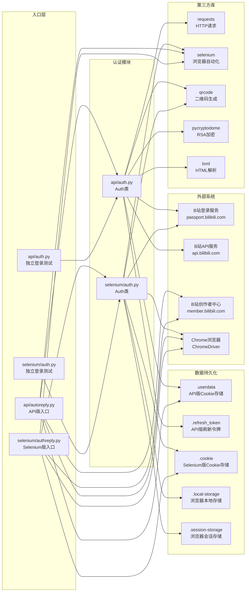

# B站自动回复工具 模块结构图 (Module Structure Diagram)

## 1. 整体模块结构图

### 图表解释

#### 1. 整体概述
- 项目采用**双版本并行架构**：`api/` 目录为 API 版本，`selenium/` 目录为 Selenium 纯浏览器版本，两个版本独立运行但共享相同业务目标
- 每个版本内部都遵循**认证-业务**两层结构：`auth.py` 负责登录态管理，`autoreply.py` / `authreply.py` 负责评论自动回复
- 两个版本都依赖外部 B 站 Web 端、创作者中心评论管理页面和 Chrome 浏览器环境

#### 2. 关键元素说明
- **`src/api/auth.py`**：基于 `requests` 库实现 B 站扫码登录，支持二维码生成、状态轮询、Cookie 自动刷新（RSA 加密 refresh_csrf）、本地 `.userdata` 持久化
- **`src/api/autoreply.py`**：Selenium 浏览器自动化程序，加载 API 版 auth 获取的 Cookie 登录 B 站评论管理页面，按时间筛选新评论并智能回复
- **`src/selenium/auth.py`**：纯 Selenium 实现的扫码登录，保存/加载 Cookie、localStorage、sessionStorage，内置反爬虫检测绕过配置
- **`src/selenium/authreply.py`**：与 `api/autoreply.py` 功能相同，但共享 `selenium/auth.py` 的 driver 实例，无需重新启动浏览器
- **`requirements.txt`**：两个版本依赖相同，包含 `selenium`、`requests`、`qrcode`、`lxml`、`pycryptodome`

#### 3. 关键流程/关系说明
1. **API 版本启动流程**：`api/autoreply.py` 导入 `api/auth.py` → 调用 `Auth.login()` 进行扫码登录或加载本地 Cookie → 获取有效登录态后启动 Selenium 浏览器 → 将 Cookie 注入浏览器 → 访问创作者中心评论页面
2. **Selenium 版本启动流程**：`selenium/authreply.py` 导入 `selenium/auth.py` → 调用 `Auth.login()` → 纯 Selenium 环境完成扫码登录 → 直接复用同一 driver 实例访问评论页面
3. 两个版本的回复逻辑几乎完全一致：解析评论时间 → 筛选新评论 → 判断关注状态 → 执行回复 → 分页扫描 → 容错处理

#### 4. 关键技术解释
- **双版本设计的技术差异**：API 版使用 `requests` 处理 HTTP 登录流程（更轻量、更快），Selenium 版完全在浏览器内完成登录（更接近真实用户行为，反爬检测更弱）；API 版需要手动将 Cookie 同步到 Selenium，Selenium 版天然共享同一浏览器会话
- **反爬虫策略**：`selenium/auth.py` 通过禁用 `AutomationControlled` 特征、排除 `enable-automation` 开关、禁用 GPU/扩展/通知等手段降低被检测概率
- **登录态持久化**：API 版使用 JSON 文件存储 Cookie 和 refresh_token；Selenium 版额外保存 localStorage 和 sessionStorage，确保浏览器状态完整恢复

#### 5. 设计意图
- **为什么要这样设计**：提供两种技术路线的自动回复方案，让用户根据实际反爬强度和环境限制选择合适版本
- **解决了什么痛点**：纯 API 方案在 Cookie 失效后需要复杂的刷新逻辑；纯 Selenium 方案启动较慢但登录态更稳定。双版本覆盖不同使用场景
- **带来了什么好处**：API 版适合 Cookie 有效期间的高频快速回复；Selenium 版适合长期挂机运行，登录态由浏览器自动维护
- **如果不这样会怎样**：单版本设计在面对 B 站反爬策略升级时缺乏备选方案，一旦某条技术路线被封禁则整个工具失效

---

## 2. 核心模块详细结构图（以 api/autoreply.py 为例）

### 图表解释

#### 1. 整体概述
- 这张图展示了 `api/autoreply.py` / `selenium/authreply.py` 的详细内部模块结构，按职责划分为**启动初始化、评论扫描、回复决策、页面操作、分页会话管理、主循环**六层
- 整个程序采用**事件驱动+定时轮询**的混合模式：外层是固定频率的定时循环，内层是一次性的会话扫描流程
- 模块之间呈流水线结构，数据（评论 DOM 元素）从扫描层流入，经决策层过滤，最终由操作层执行回复动作

#### 2. 关键元素说明
- **启动与初始化层**：配置回复频率（3 分钟）、两种回复话术模板（关注用户 vs 未关注用户）、完成 B 站认证、启动 headless Chrome、初始化 `last_seen_timestamp`
- **评论扫描层**：`process_current_page()` 是核心入口，负责遍历当前页所有评论 DOM 节点；`parse_comment_time()` 将 `'2025-03-25 21:27:38'` 格式字符串转为 `datetime`；`get_comment_identifier()` 用用户 `mid` + 评论时间生成唯一键，确保同一用户多次评论也能分别回复
- **回复决策层**：三层过滤机制——`has_reply_tag()` 检查页面是否已有回复标记（避免重复回复）、`is_comment_replied()` 检查内存集合去重、`get_follow_status()` 从 DOM 中提取关注状态标签决定回复话术
- **页面操作层**：`reply_to_comment()` 封装完整回复动作链——点击回复链接 → 等待回复框出现 → 清空并输入内容 → 点击"发表回复"按钮 → 成功后记入 `replied_comments` 集合
- **分页与会话管理层**：`process_session()` 驱动多页扫描，`click_next_page()` 触发翻页，容错机制确保当前页无新评论时再多扫一页确认，最后将本会话最新评论时间回写 `last_seen_timestamp`
- **主循环层**：`main_loop()` 每隔 `frequency` 分钟刷新评论管理页面并启动新一轮会话扫描

#### 3. 关键流程/关系说明
1. **单条评论处理流水线**：获取评论 DOM → 解析时间字符串 → 时间筛选（只处理比 `last_seen_timestamp` 新的评论）→ 回复标签检查 → 内存去重检查 → 关注状态判断 → 选择回复话术 → 执行点击-输入-提交三连操作 → 成功后标记已回复
2. **会话扫描流程**：从当前页开始扫描 → 若有符合条件的评论则点击下一页继续 → 若当前页无新评论则进入容错扫描（再点下一页确认一次）→ 若容错页仍无新评论则结束本会话 → 更新全局时间戳
3. **时间戳更新策略**：`session_max_time` 记录本会话中处理过的最新评论时间，会话结束时回写 `last_seen_timestamp`，确保下次扫描只处理更新的评论

#### 4. 关键技术解释
- **内存去重 + 页面标签双重防重**：`replied_comments` 是内存中的 `set`，程序重启后会清空，因此配合 `has_reply_tag()` 检查页面 DOM 中的回复标记，形成"内存+页面"的双重保险
- **容错扫描机制**：当一页无新评论时不立即退出，而是再翻一页确认，防止因页面加载延迟或评论分布不均导致漏扫
- **XPath 精准定位**：大量使用 `contains(@class, '...')` 和特定文本匹配的 XPath 表达式，在 B 站前端结构微调时仍具有一定容错性
- **时间精度处理**：用户输入 `"YYYY-MM-DD HH:MM:SS"` 时自动补全微秒部分，避免字符串解析与 `datetime.now()` 的精度不匹配

#### 5. 设计意图
- **为什么要这样设计**：将评论回复流程拆分为扫描-决策-操作三层，每层职责单一，便于定位问题（如回复失败是定位不到按钮还是提交失败）
- **解决了什么痛点**：B 站评论管理页面是动态加载的 SPA，评论元素需要等待渲染；不同用户的关注状态决定不同回复策略；同一用户可能多次评论需要分别回复
- **带来了什么好处**：模块化结构使得后续可以方便地扩展新功能（如关键词过滤、黑名单机制、多账号切换），而不会影响核心回复流程
- **如果不这样会怎样**：所有逻辑写在一个大循环中，DOM 定位、时间解析、回复操作混杂在一起，一旦 B 站前端改版，定位和修复问题的成本极高

---

## 3. 模块依赖关系图

### 图表解释

#### 1. 整体概述
- 这张图展示了项目各文件模块之间的 import 依赖关系、数据持久化流向以及与外部系统的交互关系
- 按层次划分为**入口层、认证模块、数据持久化、外部系统、第三方库**五层，箭头方向表示依赖/数据流向
- 两个版本（api/selenium）的依赖树相互独立，但在业务逻辑层高度相似

#### 2. 关键元素说明
- **入口层**：`api/autoreply.py` 和 `selenium/authreply.py` 是两个主程序入口；`api/auth.py` 和 `selenium/auth.py` 均可独立运行进行登录测试
- **认证模块**：`api/auth.py` 的 `Auth` 类基于 `requests` 实现，核心能力包括扫码登录、Cookie 刷新、用户信息查询；`selenium/auth.py` 的 `Auth` 类基于 `selenium` 实现，核心能力包括浏览器内扫码、Cookie/localStorage/sessionStorage 持久化
- **数据持久化**：API 版使用 `.userdata`（JSON 格式 Cookie）和 `.refresh_token`（刷新令牌）；Selenium 版使用 `.cookie`、`.local-storage`、`.session-storage` 三种文件，分别对应浏览器的三种存储机制
- **外部系统**：B 站登录服务（二维码生成与轮询）、B 站 API 服务（用户信息查询与 Cookie 刷新）、B 站创作者中心（评论管理页面）、Chrome 浏览器（Selenium 驱动）
- **第三方库**：`requests`（API 版 HTTP 通信）、`selenium`（浏览器自动化）、`qrcode`（终端二维码显示）、`pycryptodome`（RSA-OAEP 加密 refresh_csrf）、`lxml`（解析 correspond 页面获取 refresh_csrf）

#### 3. 关键流程/关系说明
1. **API 版数据流**：`api/autoreply.py` import `api/auth.py` → `Auth.login()` 尝试加载 `.userdata` → 若 Cookie 有效则直接使用；若过期则调用 `auto_refresh_cookie()` → 使用 `pycryptodome` RSA 加密时间戳获取 `refresh_csrf` → 调用 B 站 API 刷新 Cookie → 保存新的 `.userdata` 和 `.refresh_token` → 返回 Cookie 字典给 `autoreply.py` → `autoreply.py` 启动 Selenium 并将 Cookie 注入浏览器
2. **Selenium 版数据流**：`selenium/authreply.py` import `selenium/auth.py` → `Auth.login()` 尝试加载 `.cookie`、`.local-storage`、`.session-storage` → 若有效则直接复用 driver；若无效则浏览器内扫码登录 → 保存三种存储文件 → `authreply.py` 直接复用同一 driver 实例访问创作者中心
3. **依赖差异**：API 版认证依赖 `requests` + `pycryptodome` + `lxml`；Selenium 版认证仅依赖 `selenium` + `qrcode`，但运行时仍需 Chrome 浏览器

#### 4. 关键技术解释
- **Cookie 刷新机制（API 版独有）**：B 站的 Cookie 刷新需要先用 RSA-OAEP 加密当前时间戳，访问特定的 correspond 页面获取 `refresh_csrf`，再携带原 `csrf`、`refresh_csrf` 和 `refresh_token` 调用刷新接口，最后还要调用确认接口使旧 Cookie 失效。这是一个完整的三步握手流程
- **浏览器状态持久化（Selenium 版独有）**：现代 Web 应用不仅依赖 Cookie，还依赖 localStorage 和 sessionStorage 保存前端状态。Selenium 版通过 `execute_script` 遍历并导出这些存储，下次启动时重新注入，最大程度还原浏览器会话
- **driver 实例共享**：`selenium/authreply.py` 通过 `auth_client.get_driver()` 获取已登录的 driver，避免了重复启动浏览器和重新登录的开销

#### 5. 设计意图
- **为什么要这样设计**：将认证逻辑与业务逻辑彻底解耦，auth 模块只负责"拿到有效登录态"，reply 模块只负责"用登录态做回复"，两者通过明确的接口（Cookie 字典或 driver 实例）交接
- **解决了什么痛点**：登录逻辑复杂（扫码、轮询、刷新、持久化），与回复逻辑（DOM 操作、时间筛选、分页）是完全不同的技术域，解耦后各自可以独立演进和测试
- **带来了什么好处**：auth 模块可以独立运行验证登录功能；reply 模块可以 mock 登录态进行回复逻辑测试；两个版本的 reply 模块业务逻辑高度一致，维护成本低
- **如果不这样会怎样**：认证与回复逻辑耦合在一个文件中，代码冗长难以阅读；登录态获取失败时无法判断是认证问题还是回复逻辑问题；两个版本无法复用相同的回复逻辑

---

*生成时间: 2026-05-14*
*模式: 深度*
*所属项目: B站自动回复工具*
*文件包含: 3 张图*
