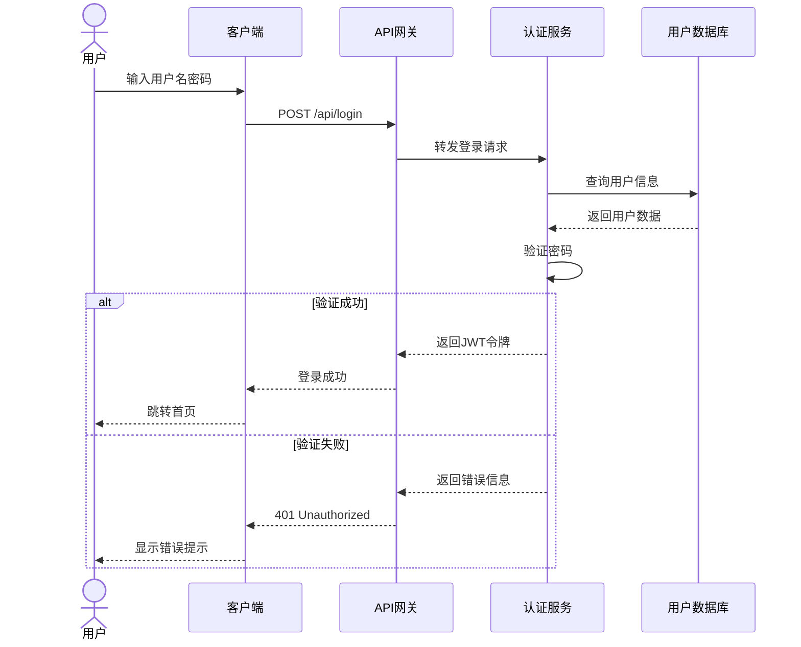
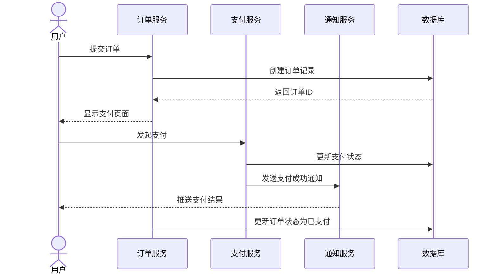

# 示例项目 时序图 (Sequence Diagram)

## 1. 用户登录流程

### 图表解释

#### 1. 整体概述
- 这张图讲的是：用户登录系统的完整交互流程
- 解决什么问题：清晰展示登录过程中各组件的协作关系
- 核心看点：异常处理分支、JWT令牌发放机制

#### 2. 关键元素说明
- **用户**：发起登录请求的终端用户
- **客户端**：浏览器或移动应用，负责收集用户输入
- **API网关**：统一入口，负责请求路由和初步校验
- **认证服务**：核心服务，处理身份验证逻辑
- **用户数据库**：存储用户凭证和基本信息

#### 3. 关键流程说明
- **正常流程**：用户输入 → 客户端提交 → API网关转发 → 认证服务查询数据库 → 验证密码 → 发放JWT
- **异常流程**：密码错误时返回401，客户端提示用户重新输入

#### 4. 关键技术解释
- **JWT（JSON Web Token）**：无状态认证机制，包含用户信息和签名
- **密码验证**：通常使用 bcrypt 等慢哈希算法防止暴力破解
- **API网关**：统一处理限流、日志、路由等横切关注点

#### 5. 设计意图
- 为什么要这样设计：分离认证逻辑与业务逻辑，便于统一管理和扩展
- 解决了什么痛点：避免每个服务单独实现认证，减少重复代码
- 带来了什么好处：单点登录、统一安全策略、便于审计
- 如果不这样会怎样：认证逻辑分散，维护困难，安全策略难以统一

---

## 2. 订单支付流程

### 图表解释

#### 1. 整体概述
- 这张图讲的是：从下单到支付完成的完整业务流程
- 解决什么问题：展示订单与支付服务的协作关系
- 核心看点：状态同步、异步通知机制

#### 2. 关键元素说明
- **订单服务**：处理订单生命周期管理
- **支付服务**：对接第三方支付渠道
- **通知服务**：负责消息推送和邮件通知

#### 3. 关键流程说明
- **订单创建**：用户提交 → 订单服务持久化 → 返回订单ID
- **支付处理**：用户发起支付 → 支付服务处理 → 异步通知用户
- **状态同步**：支付成功后更新订单状态

#### 4. 关键技术解释
- **异步通知**：支付结果通过消息队列异步发送，降低耦合
- **状态机**：订单状态流转（待支付 → 已支付 → 已发货 → 已完成）
- **幂等性**：支付接口需要保证多次调用结果一致

#### 5. 设计意图
- 为什么要这样设计：支付流程涉及多个服务，需要解耦和异步处理
- 解决了什么痛点：避免支付阻塞订单服务，提高系统吞吐量
- 带来了什么好处：服务独立扩展、故障隔离、用户体验更好
- 如果不这样会怎样：同步调用导致响应慢，单点故障影响整个流程

---

*生成时间: 2024-01-01*
*模式: 深度*
*所属项目: 示例项目*
*文件包含: 2 张图*
