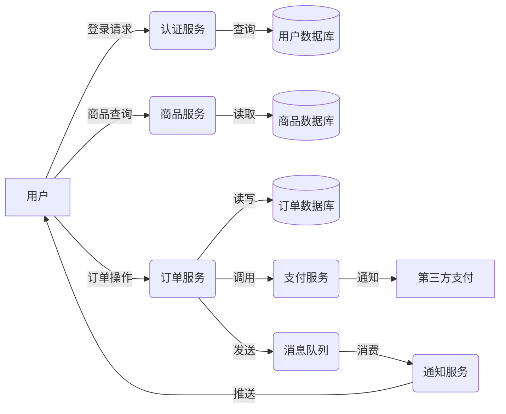
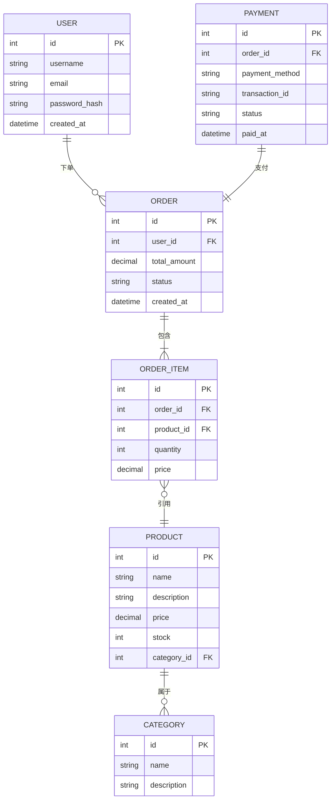

# 示例项目 数据流 E-R 图 (Data Flow & E-R Diagram)

## 1. 系统数据流图

### 图表解释

#### 1. 整体概述
- 这张图讲的是：系统中数据的流动路径和方向
- 解决什么问题：展示数据在各服务间的流转关系
- 核心看点：数据分层存储、异步消息机制

#### 2. 关键元素说明
- **外部实体（方框）**：用户、第三方支付
- **处理过程（圆角矩形）**：各业务服务
- **数据存储（圆柱）**：数据库
- **数据流（箭头）**：数据传递方向

#### 3. 关键流程说明
- **认证流程**：用户请求 → 认证服务 → 用户数据库 → 返回结果
- **购物流程**：用户查询商品 → 创建订单 → 调用支付 → 异步通知
- **消息通知**：订单状态变更 → 消息队列 → 通知服务 → 用户

#### 4. 关键技术解释
- **数据库拆分**：按业务域分库，避免单点瓶颈
- **消息队列**：解耦服务，实现异步处理
- **分布式事务**：订单和支付的数据一致性保障

#### 5. 设计意图
- 为什么要这样设计：微服务架构下数据需要合理分布
- 解决了什么痛点：避免单库压力，支持独立扩展
- 带来了什么好处：高可用、高性能、易维护
- 如果不这样会怎样：单数据库成为瓶颈，扩展困难

---

## 2. 实体关系图

### 图表解释

#### 1. 整体概述
- 这张图讲的是：核心业务实体及其关联关系
- 解决什么问题：展示数据模型的结构设计
- 核心看点：主外键关系、一对多/多对多关系

#### 2. 关键元素说明
- **USER**：用户实体，系统核心主体
- **ORDER**：订单实体，记录交易信息
- **ORDER_ITEM**：订单项，关联订单和商品
- **PRODUCT**：商品实体，存储商品信息
- **CATEGORY**：分类实体，商品归类
- **PAYMENT**：支付记录，关联订单

#### 3. 关键关系说明
- **用户-订单**：一对多，一个用户可有多个订单
- **订单-订单项**：一对多，一个订单包含多个商品
- **订单项-商品**：多对一，多个订单项可引用同一商品
- **商品-分类**：多对一，商品属于一个分类
- **支付-订单**：一对一，一个订单对应一次支付

#### 4. 关键技术解释
- **主键（PK）**：唯一标识每条记录
- **外键（FK）**：建立表间关联关系
- **索引优化**：外键字段通常需要建立索引
- **级联操作**：删除订单时是否级联删除订单项

#### 5. 设计意图
- 为什么要这样设计：第三范式规范化，减少数据冗余
- 解决了什么痛点：数据一致性、更新异常
- 带来了什么好处：结构清晰、易于维护、扩展性好
- 如果不这样会怎样：数据冗余、更新异常、空间浪费

---

*生成时间: 2024-01-01*
*模式: 深度*
*所属项目: 示例项目*
*文件包含: 2 张图*
