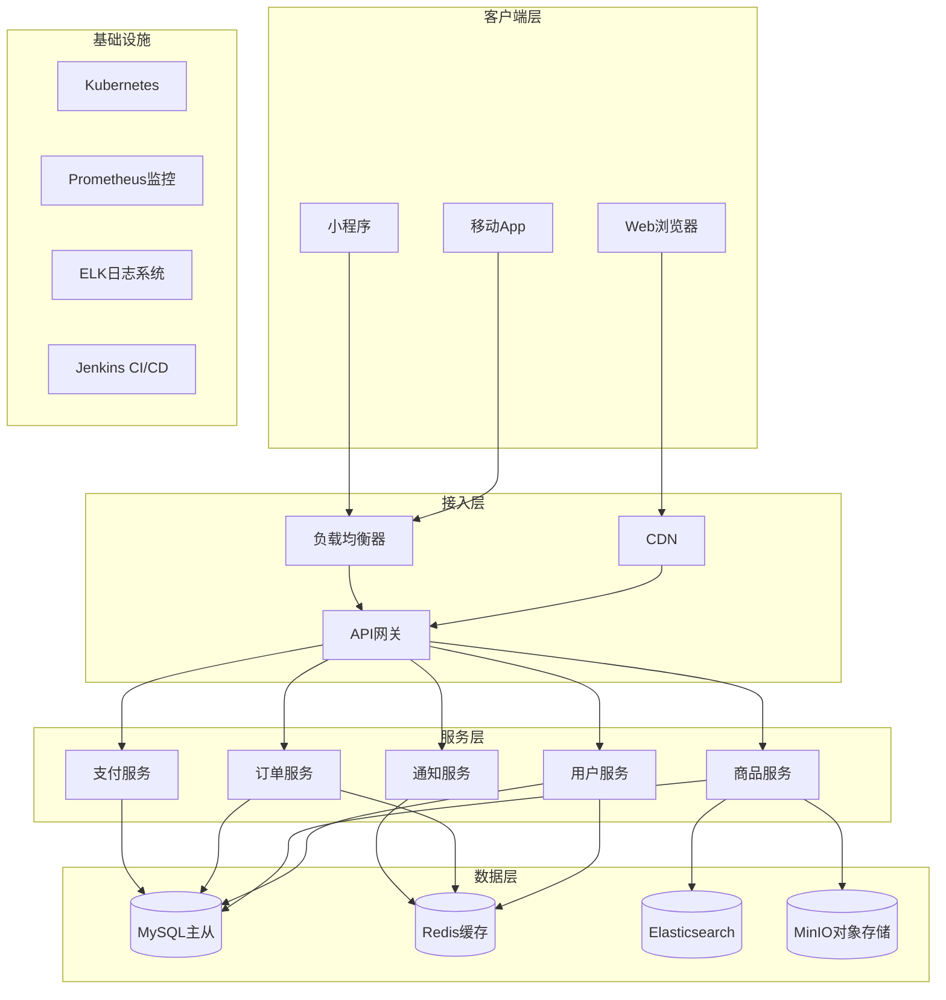
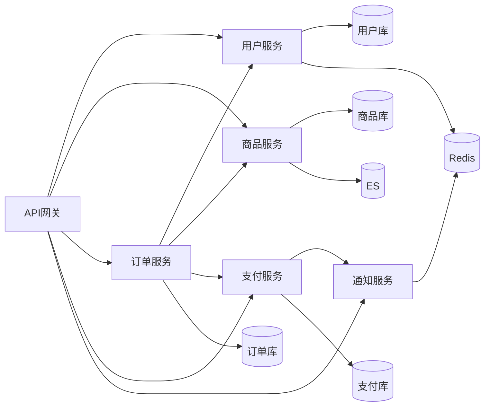

# 示例项目 系统架构图 (System Architecture)

## 1. 整体架构图

### 图表解释

#### 1. 整体概述
- 这张图讲的是：电商系统的分层架构设计
- 解决什么问题：展示系统各层组件及其调用关系
- 核心看点：微服务拆分、数据层分离、基础设施支撑

#### 2. 关键元素说明
- **客户端层**：多终端接入（Web、App、小程序）
- **接入层**：流量入口，负责分发和路由
- **服务层**：核心业务逻辑，按领域拆分服务
- **数据层**：持久化和缓存，针对不同场景选型
- **基础设施**：运维支撑，保障系统稳定运行

#### 3. 关键流程说明
- **请求流程**：客户端 → CDN/负载均衡 → API网关 → 具体服务
- **数据流程**：服务 → 数据库/缓存/搜索引擎
- **部署流程**：Jenkins 构建 → Kubernetes 部署

#### 4. 关键技术解释
- **微服务架构**：按业务域拆分独立服务，支持独立部署
- **API网关**：统一认证、限流、路由、日志
- **Kubernetes**：容器编排，自动扩缩容
- **Redis**：缓存热点数据，减轻数据库压力
- **Elasticsearch**：全文搜索，支持商品搜索

#### 5. 设计意图
- 为什么要这样设计：分层解耦，支持大规模并发
- 解决了什么痛点：单体应用难以扩展和维护
- 带来了什么好处：独立扩展、技术栈灵活、故障隔离
- 如果不这样会怎样：系统耦合严重，难以应对高并发

---

## 2. 服务调用关系图

### 图表解释

#### 1. 整体概述
- 这张图讲的是：微服务间的调用依赖关系
- 解决什么问题：展示服务间的耦合程度
- 核心看点：订单服务是核心枢纽，依赖多个服务

#### 2. 关键元素说明
- **API网关**：所有请求的入口
- **用户服务**：处理用户相关逻辑
- **商品服务**：管理商品信息
- **订单服务**：核心服务，协调多个服务
- **支付服务**：处理支付逻辑
- **通知服务**：发送各类通知

#### 3. 关键流程说明
- **下单流程**：订单服务调用用户服务（校验用户）、商品服务（校验库存）、支付服务（发起支付）
- **支付回调**：支付服务通知订单服务更新状态，同时通知通知服务发送消息

#### 4. 关键技术解释
- **服务注册发现**：服务间调用通过注册中心定位
- **熔断降级**：防止故障扩散，保护核心服务
- **分布式链路追踪**：追踪请求在各服务间的流转

#### 5. 设计意图
- 为什么要这样设计：订单是核心业务，需要协调多个领域
- 解决了什么痛点：避免循环依赖，保持单向依赖
- 带来了什么好处：依赖清晰，便于测试和维护
- 如果不这样会怎样：循环依赖导致系统难以维护和调试

---

*生成时间: 2024-01-01*
*模式: 深度*
*所属项目: 示例项目*
*文件包含: 2 张图*
