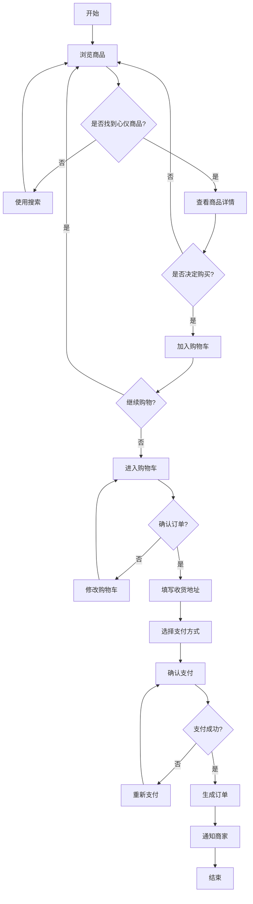
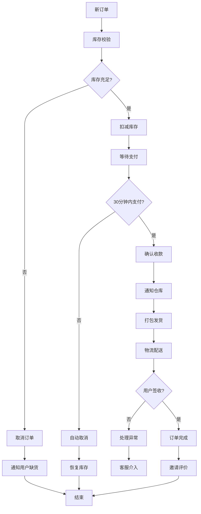

# 示例项目 业务流程图 (Business Process)

## 1. 用户购物流程

### 图表解释

#### 1. 整体概述
- 这张图讲的是：用户从浏览到完成购买的完整流程
- 解决什么问题：梳理用户购物的核心路径和分支
- 核心看点：循环浏览、决策分支、异常处理

#### 2. 关键元素说明
- **开始/结束**：流程的起点和终点
- **处理步骤**：具体的业务操作
- **判断节点**：用户决策点，产生分支
- **箭头方向**：流程走向

#### 3. 关键流程说明
- **主流程**：浏览 → 选品 → 加购 → 结算 → 支付 → 成单
- **循环路径**：未找到商品继续浏览，支付失败重新支付
- **分支处理**：每个决策点都有明确的后续动作

#### 4. 关键技术解释
- **状态机**：订单状态流转控制
- **库存预占**：下单时预留库存，支付成功后扣减
- **超时取消**：未支付订单自动取消，释放库存

#### 5. 设计意图
- 为什么要这样设计：符合用户购物习惯，降低决策成本
- 解决了什么痛点：引导用户完成购买，减少流失
- 带来了什么好处：用户体验流畅，转化率提升
- 如果不这样会怎样：流程复杂导致用户放弃购买

---

## 2. 订单处理流程

### 图表解释

#### 1. 整体概述
- 这张图讲的是：订单从创建到完成的处理流程
- 解决什么问题：展示订单生命周期和各环节处理
- 核心看点：超时机制、异常处理、库存管理

#### 2. 关键元素说明
- **库存校验**：确保商品有货才能下单
- **支付超时**：30分钟未支付自动取消
- **物流跟踪**：配送过程的状态更新

#### 3. 关键流程说明
- **正常流程**：下单 → 校验 → 支付 → 发货 → 签收 → 完成
- **异常流程**：缺货取消、超时取消、配送异常
- **补偿机制**：取消时恢复库存，避免超卖

#### 4. 关键技术解释
- **定时任务**：扫描超时订单自动取消
- **库存扣减**：采用预占机制，防止超卖
- **消息通知**：各节点状态变更触发通知

#### 5. 设计意图
- 为什么要这样设计：保证订单数据一致性，防止资损
- 解决了什么痛点：超卖、重复支付、订单丢失
- 带来了什么好处：数据准确，用户体验好
- 如果不这样会怎样：库存混乱，用户投诉

---

*生成时间: 2024-01-01*
*模式: 深度*
*所属项目: 示例项目*
*文件包含: 2 张图*
