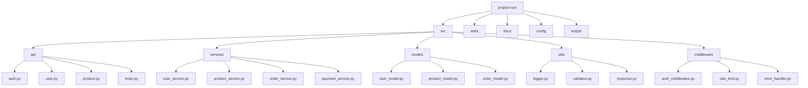
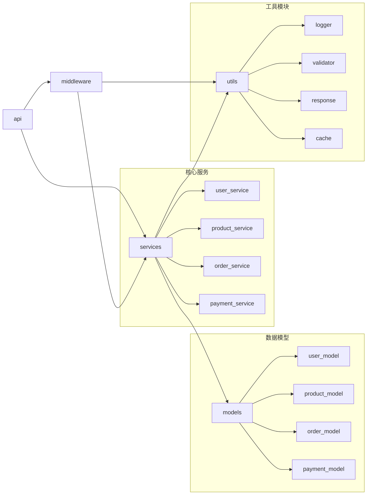

# 示例项目 模块结构图 (Module Structure)

## 1. 项目目录结构图

### 图表解释

#### 1. 整体概述
- 这张图讲的是：项目的顶层目录和模块划分
- 解决什么问题：展示代码组织的层次结构
- 核心看点：按职责分层，清晰的模块边界

#### 2. 关键元素说明
- **src**：源代码主目录
- **api**：路由和接口定义
- **services**：业务逻辑层
- **models**：数据模型层
- **utils**：工具函数
- **middleware**：中间件

#### 3. 关键流程说明
- **请求处理**：api → middleware → services → models
- **模块职责**：每层只处理特定职责，单向依赖

#### 4. 关键技术解释
- **MVC/MVVM**：分层架构模式
- **依赖注入**：服务层解耦
- **中间件链**：请求预处理管道

#### 5. 设计意图
- 为什么要这样设计：关注点分离，便于维护和测试
- 解决了什么痛点：代码混乱，职责不清
- 带来了什么好处：结构清晰，易于扩展
- 如果不这样会怎样：代码耦合，难以维护

---

## 2. 模块依赖关系图

### 图表解释

#### 1. 整体概述
- 这张图讲的是：各模块间的导入依赖关系
- 解决什么问题：展示模块间的耦合程度
- 核心看点：单向依赖，避免循环引用

#### 2. 关键元素说明
- **api**：依赖 middleware 和 services
- **middleware**：依赖 services 和 utils
- **services**：核心层，依赖 models 和 utils
- **models**：最底层，被 services 依赖
- **utils**：公共工具，被多层依赖

#### 3. 关键流程说明
- **依赖方向**：上层依赖下层，同层不依赖
- **核心服务**：业务逻辑的核心实现
- **工具复用**：utils 被多个模块共享

#### 4. 关键技术解释
- **依赖倒置**：面向接口编程
- **循环依赖检测**：工具检测并阻止循环引用
- **模块边界**：清晰的导入规则

#### 5. 设计意图
- 为什么要这样设计：保持依赖单向，降低耦合
- 解决了什么痛点：循环依赖导致编译/运行问题
- 带来了什么好处：模块可独立测试和替换
- 如果不这样会怎样：循环依赖，难以维护和重构

---

*生成时间: 2024-01-01*
*模式: 深度*
*所属项目: 示例项目*
*文件包含: 2 张图*
