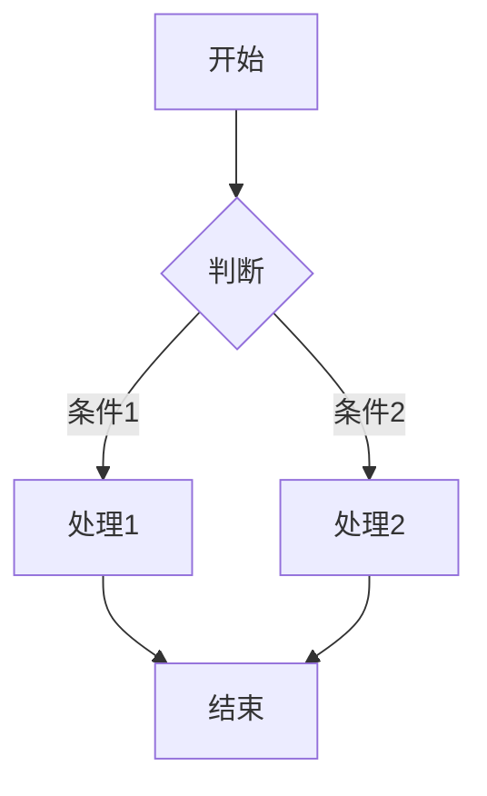
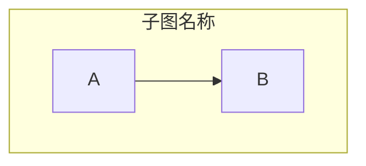
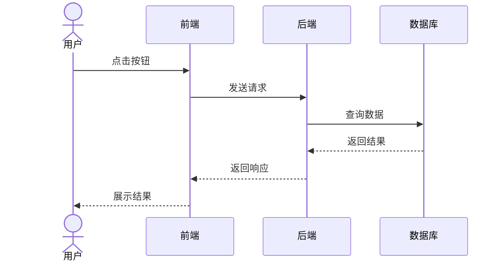
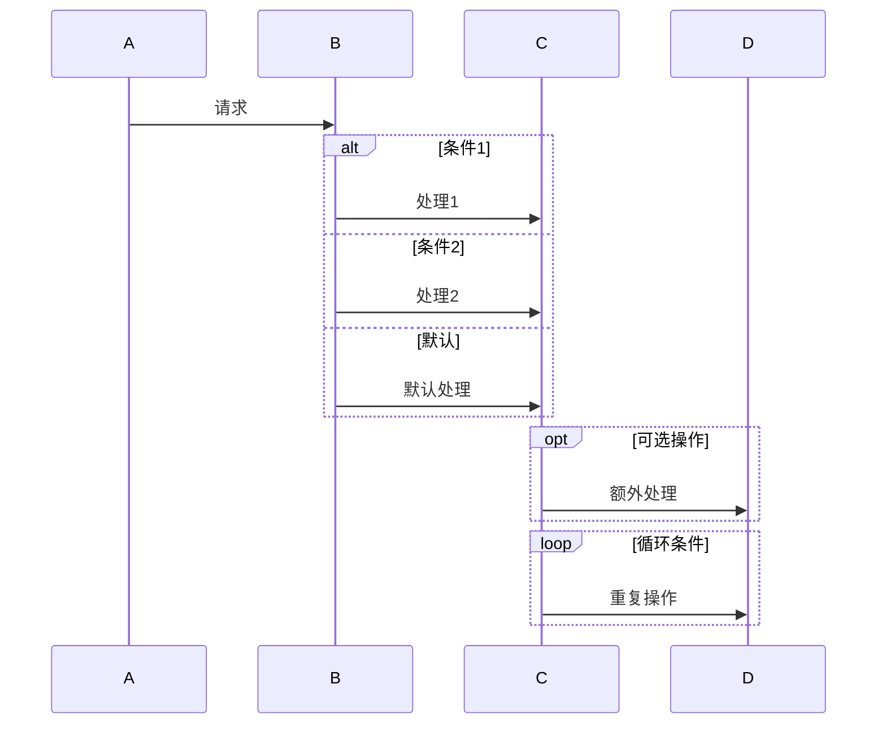
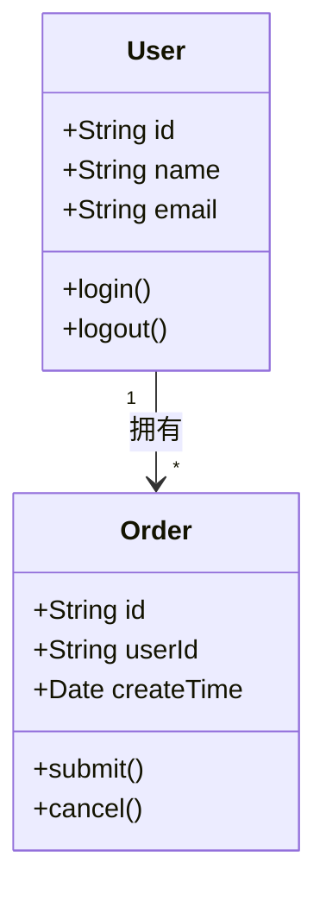
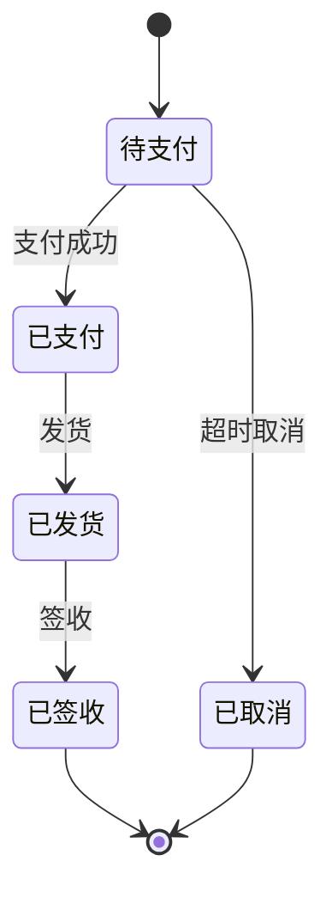
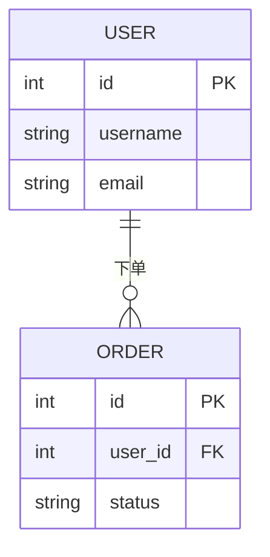
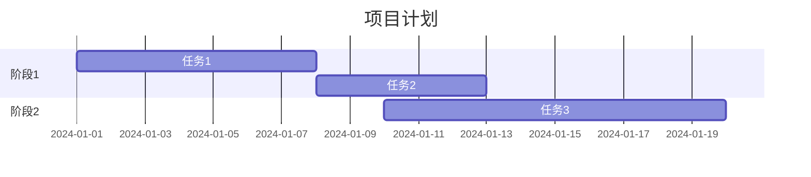
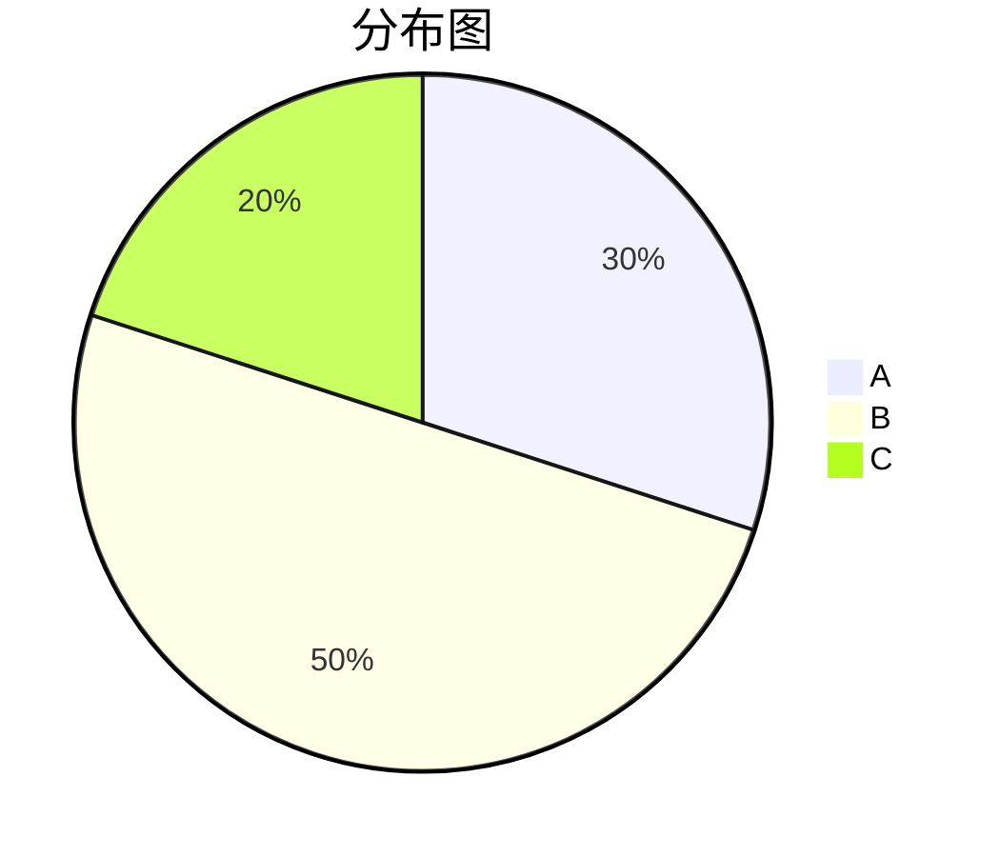

# Mermaid 语法参考

## 1. 流程图 (Flowchart)



### 基本语法
- `flowchart TD`：从上到下（Top Down）
- `flowchart LR`：从左到右（Left Right）
- `flowchart TB`：从上到下（Top Bottom）
- `flowchart RL`：从右到左（Right Left）
- `flowchart BT`：从下到上（Bottom Top）

### 节点形状
- `[文本]`：矩形
- `(文本)`：圆角矩形
- `((文本))`：圆形
- `{文本}`：菱形（判断）
- `[/文本/]`：平行四边形
- `[\文本\]`：平行四边形（反向）

### 箭头类型
- `-->`：实线箭头
- `---`：实线无箭头
- `-.->`：虚线箭头
- `==>`：粗线箭头
- `-->|标签|`：带标签的箭头

### 子图


## 2. 时序图 (Sequence Diagram)



### 基本语法
- `actor 名称`：定义参与者（人）
- `participant 名称`：定义参与者（系统）
- `->>`：实线箭头
- `-->>`：虚线箭头（返回）
- `->>+`：激活生命线
- `-->>-`：结束激活

### 控制结构


## 3. 类图 (Class Diagram)



### 关系类型
- `-->`：关联（Association）
- `*--`：组合（Composition）
- `o--`：聚合（Aggregation）
- `--|>`：继承（Inheritance）
- `..|>`：实现（Realization）
- `..>`：依赖（Dependency）

### 可见性
- `+`：public
- `-`：private
- `#`：protected
- `~`：package

## 4. 状态图 (State Diagram)



## 5. E-R 图 (Entity Relationship)



### 关系基数
- `||--o{`：一对多
- `||--||`：一对一
- `}o--o{`：多对多

## 6. 用例图 (Use Case Diagram)

```mermaid
usecaseDiagram
    actor 用户
    actor 管理员

    package 系统 {
        usecase "登录" as UC1
        usecase "注册" as UC2
        usecase "管理用户" as UC3
    }

    用户 --> UC1
    用户 --> UC2
    管理员 --> UC3
    UC3 ..> UC1 : include
```

### 关系
- `-->`：关联
- `..>`：包含（include）
- `..>`：扩展（extend）

## 7. 甘特图 (Gantt)



## 8. 饼图 (Pie)



## 常见错误与修复

### 1. 特殊字符问题
```
错误: A[内容[1]]
修复: A["内容[1]"]

错误: B(方法())
修复: B("方法()")
```

### 2. 括号不匹配
```
错误: subgraph 名称
      A --> B
修复: subgraph 名称
      A --> B
      end
```

### 3. 关键字错误
```
错误: sequanceDiagram
修复: sequenceDiagram

错误: classdiagram
修复: classDiagram
```

### 4. 箭头格式
```
错误: A -> B
修复: A --> B

错误: A ==> B
修复: A ==> B（仅在 flowchart 中有效）
```

## 渲染环境

- GitHub/GitLab：支持大部分 Mermaid 图表
- VS Code：安装 Mermaid 插件可预览
- Markdown 阅读器：需支持 Mermaid 渲染
- 在线编辑器：https://mermaid.live
